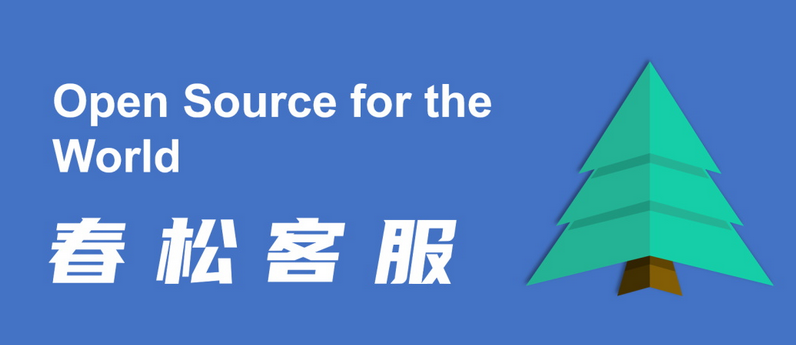
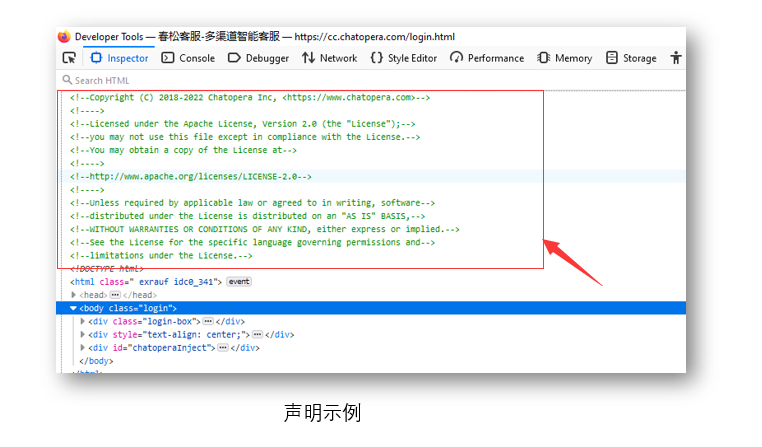

# 开源许可协议

春松客服开源以来，完成了超过 170,000 次官网 Docker 镜像部署，超过 1,000 家企业使用，得到社会各界关注。我们收到来自于开发者、企业、IT 集成商、其他开源社区的对春松客服的发展情况、开源社区治理的数千次咨询，尤其是有意于使用春松客服上线客服系统的企业或开发者。



很多人惊叹于春松客服的功能、代码质量和文档，在认可春松客服之后，大家最多关心的就是：春松客服的开源许可协议。因为站在用户角度，开源协议明确回答了：

* 作为春松客服使用者，我得到代码和软件安装包后，我有哪些权力；
* 作为开源开发者，我贡献代码有那些好处；
* 作为春松客服发布者和维护者，你们对我有什么要求。

开源软件(OpenSource Software)是伴随着自由软件(Free Software)商业化过程中出现的术语。没有开源软件就没有今天数字化生活，互联网时代。开源许可协议就是围绕软件制作、软件销售、软件产权的契约。这个契约有关各方的权力、义务和回报。这个契约因为有法律约束力，它将软件发布者、软件维护者、软件用户、软件销售者凝聚在一起，促进这个集体的合作，创造价值。了解这个契约，就会认识开源的魅力；认识了开源的魅力，就会认可开源的精神；认可开源的精神，就会受到鼓舞，参与开源社区的建设；参与开源社区的建设，就会带来精神和物质的回报；有了丰富的精神和物质生活，就是我们实现了开源的初心：自由的人做自由的软件。虽然我们会谈到钱，但自由的价值是无法衡量的。所以，作为开源客服系统春松客服的发布者，我期待下载春松客服的源码的人，可以读到这篇文章：让我们共同的遵守这个契约，一起做好开源客服系统。

春松客服使用的开源许可协议是 Apache 2.0，该协议文件在春松客服源码文件的头部和代码库的 [LICENSE](https://github.com/chatopera/cskefu/blob/osc/LICENSE) 文件中，都有携带，受限于以上形式的篇幅，不能详细描述，本文将对内容进行展开，用更简单的语言，口语化的描述。

春松客服采用的开源许可协议详细阐述分为五个部分：

* 称呼定义
* 用户必须遵守什么
* 用户可以做什么
* 用户如果想提交代码
* 对违反协议的用户

## 一、称呼定义

以下“用户”、“您”泛指所有和春松客服有关联的人或组织，包括但不限于：源码或安装包的使用者、开发者、维护者、报告（缺陷、性能、瓶颈、文档、需求、建议、测试）者、发布者、集成商、继承春松客服衍生的企业软件的开发者。开发者指独立的人、企业、机构等。

以下“我”、“开发者”泛指所有提交源代码到春松客服软件库的人或组织。

## 二、用户必须遵守什么

### 2.1 保留春松客服的开源许可协议声明

在您使用春松客服的源码、软件及衍生作品时，必须保留春松客服的声明。

* 2.1.1 源码库的 LICENSE 和 NOTICE 文件(如果[春松客服官方代码库](https://github.com/chatopera/cskefu/)存在该文件)


* 2.1.2 在源文件的头部

服务端声明示例：


客户端声明示例：




* 2.1.3 在引用春松客服时进行说明

您可以引用“春松客服”及其 LOGO 以表述春松客服和春松客服开源社区，当您使用春松客服及其安装包，对外提供基于春松客服和其衍生作品时，必须声明春松客服及其官网地址：<https://www.cskefu.com> 或 官网源代码仓库 <https://github.com/chatopera/cskefu>。

### 2.2 不许使用春松客服作为您的产品的商标

作为用户，不允许您使用“春松客服”及春松客服 LOGO 作为您的商品名、商标、服务标志或产品名。


## 三、用户可以做什么

在遵守前述条件情况下，您享有下面的权力。

### 3.1 享受自有的版权

作为用户，您可以免费复制、使用、修改、再许可、分发本作品及衍生作品，该作品的源代码可以不公开。

### 3.2 享受自有的专利

作为用户，我在此授予你专利许可：即使您的专利涉及我的专利、我的潜在专利，你也可以永久性地免费使用你的专利，用于制作、使用、出售、转让春松客服相关的作品，包括衍生于春松客服的作品；但是，如果您利用你的专利告春松客服侵犯了您的权益，那么你的专利许可，在你告我那天，我授予你的专利许可被我收回，你的专利将不具备法律基础。

### 3.3 销售

作为用户，您可以销售春松客服、你修改后的春松客服、或其它衍生于春松客服的作品。

## 四、用户如果想提交代码

### 4.1 参与贡献

作为用户，您可以提交代码到春松客服源码库，成为春松客服开发者。

* 4.1.1 改动文件

作为春松客服开发者，在您的改动文件中，应带有您的修改的声明；或者不声明，默认就是春松客服采用的 Apache 2.0 协议。

改动的声明，比如在文件最开头，添加 Modifications copyright：

```text
/*
 * Copyright (C) 2018-2022 Chatopera Inc, <https://www.chatopera.com>
 * Modifications copyright (C) {YEAR} {YOUR NAME}
 *
 * Licensed under the Apache License, Version 2.0 (the "License");
 * you may not use this file except in compliance with the License.
 * You may obtain a copy of the License at
 *
 * http://www.apache.org/licenses/LICENSE-2.0
 *
 * Unless required by applicable law or agreed to in writing, software
 * distributed under the License is distributed on an "AS IS" BASIS,
 * WITHOUT WARRANTIES OR CONDITIONS OF ANY KIND, either express or implied.
 * See the License for the specific language governing permissions and
 * limitations under the License.
 */
```

* 4.1.2 新增文件

作为春松客服开发者，在您新增的文件中，应带有您的声明；如果不声明，默认就是春松客服采用的 Apache 2.0 协议。

### 4.2 免责

作为用户，您使用、销售春松客服过程中，遇到任何的麻烦，不要认为春松客服的发布者、维护者应承担法律责任。任何春松客服开发者提交到开源社区的代码，都是出于优化增强软件的目的，但是不保证没有 BUG、缺陷、瓶颈等，我们不对春松客服给您造成的任何经济损失承担责任。除非您和春松客服的开发者、维护者另外签订了协议，那么该开发者、维护者将承担潜在的责任和法律风险。

## 五、对违反协议的用户

春松客服采用的开源许可协议是开放、商业友好、宽松的，充分的表达了我们的心声：合作共赢。但是如果，如果我们发现使用春松客服源码的人，有违反春松客服采用的开源许可协议，我们将：

* 诉诸法律 - 您需要承担法律责任，并承担一切诉讼费用、我方经济损失和您的违法所得

* 诉诸媒体 - 将您的行为公布于开源社区，成为不遵守知识产权的案例

同时，在遵守我国法律的前提下，我们不放弃任何可以惩治您的方法：对于那些不遵守我们立的契约而伤害我们权益的人，我们是不宽容的。

## 引用及参考文献

1. [逐句深扒 Apache 许可协议原文，一文看懂！](https://www.163.com/dy/article/FCE1GN2K0511FQO9.html)

2. [开源定义是什么？为什么OSI不接受SSPL？](https://www.51cto.com/article/671655.html)

3. [如何选择开源许可证？](https://www.ruanyifeng.com/blog/2011/05/how_to_choose_free_software_licenses.html)

4. [一文看懂开源许可证，能不能商用再也不抓瞎](https://www.easemob.com/news/4415)

5. [了解开源的许可证GPL、LGPL、BSD、Apache 2.0的区别](https://www.cnblogs.com/fbwfbi/p/3440327.html)

6. [一文看懂开源许可证丨开源知识科普](https://pingcap.com/zh/blog/introduction-of-open-source-license)

7. [详细介绍 Apache Licence 2.0 协议](https://www.oschina.net/question/12_2828)

8. [开源许可违反：案例说明（Apache License 2.0）](https://blog.csdn.net/liumiaocn/article/details/107368370)

9. [Open Source Licenses 101: Apache License 2.0](https://fossa.com/blog/open-source-licenses-101-apache-license-2-0/)

## 附件

### Apache 2.0 中文协议（法律声明）

[Apache License, Version 2.0](https://www.apache.org/licenses/LICENSE-2.0.html) 的官方文本地址：[https://www.apache.org/licenses/LICENSE-2.0.html](https://www.apache.org/licenses/LICENSE-2.0.html)

以下内容为 Apache 2.0 协议条款的中文翻译版。

Apache License
2.0 版，2004 年 1 月
<http://www.apache.org/licenses/>

使用，复制和分发的条款和条件

#### 定义

“许可”是指本文档第 1 至 9 节定义的使用，复制和分发的条款和条件。

“许可人”是指版权所有者或授予许可的版权所有者授权的实体。

“法律实体”是指行为实体与控制该实体，由该实体控制或受其共同控制的所有其他实体的联合。就本定义而言，“控制”是指(i)不论是通过 Contract 还是其他方式直接或间接引起该实体的指示或 Management 的权力，或(ii)百分之五十(50％)的所有权或更多的已发行股票，或(iii)该实体的实益拥有权。

“您”(或“您的”)是指行使本许可授予的许可的个人或法人实体。

“源”形式是指进行修改的首选形式，包括但不限于软件源代码，文档源和配置文件。

“对象”形式是指源形式的机械转换或翻译产生的任何形式，包括但不限于已编译的目标代码，生成的文档以及对其他媒体类型的转换。

“作品”是指根据许可获得的著作权作品，无论是源形式还是对象形式，均应包含在该作品中或随附于其上的版权声明所指示(以下附录中提供了一个示例)。

“衍生作品”是指基于(或衍生自)该作品的任何作品(无论是源形式还是对象形式)，并且其编辑修订，注解，细化或其他修改从整体上代表原始作品的作者身份。就本许可而言，衍生作品不应包括与该作品及其衍生作品保持分离或仅链接(或按名称绑定)的作品。

“贡献”是指版权拥有者，个人或个人有意向许可人提交以包括在作品中的任何创作作品，包括作品的原始版本以及对该作品或其衍生作品的任何修改或增补。授权代表版权所有者提交的法人实体。就此定义而言，“已提交”是指发送给许可方或其代表的任何形式的电子，口头或书面通讯，包括但不限于有关电子邮件列表，源代码控制系统和问题跟踪系统的通讯，由许可方或代表许可方 Management，以讨论和改进本作品，但不包括版权拥有者明显标记或以其他方式书面指定为“非贡献”的通信。

“贡献者”是指许可人以及许可人已经代表其收到贡献并随后合并到作品中的任何个人或法人实体。

#### 版权许可的授予

在遵守本许可的条款和条件的前提下，每位贡献者特此向您授予永久性的，Global 性的，非排他性的，免费的，免版税的，不可撤销的版权许可，以复制，准备衍生产品以来源或客体形式对作品及此类衍生作品进行公开展示，公开表演，再许可和分发的作品。

#### 专利许可的授予

在遵守本许可的条款和条件的前提下，每位贡献者特此向您授予永久，Global 性，非排他性，免费，免版税，不可撤销的许可(本节中所述除外) )制作，制作，使用，提供要约，出售，import，以及以其他方式转让作品的专利许可，但该许可仅适用于该贡献者应许可的专利索赔，而这些专利索赔仅因其贡献而受到侵犯或将他们的贡献与提交的作品相结合。如果您针对任何实体(包括诉讼中的交叉索赔或反索赔)提起专利诉讼，指称该作品或该作品中包含的贡献构成直接或共同的专利侵权，则根据本许可授予您的任何专利许可该工作应在提起诉讼之日终止。

#### 再分发

##### 只要您满足以下条件，您可以在任何媒介中以修改或不修改的形式，以源或对象的形式复制和分发作品或衍生作品的副本

* 您必须向该作品或衍生作品的任何其他接收者提供本许可的副本；和

* 您必须使所有修改过的文件带有明显的声明，表明您已更改文件；和

* 您必须以您分发的任何衍生作品的“源”形式保留该作品“源”形式的所有版权，专利，商标和出处声明，但与这些衍生作品的任何部分无关的那些声明除外；和

* 如果作品包含“注意”文本文件作为其分发的一部分，则您分发的任何衍生作品都必须包括该通知文件中包含的署名声明的可读副本，但不包括与声明的任何部分无关的那些声明。衍生作品，至少应位于以下至少一个位置：在作为衍生作品一部分分发的 NOTICE 文本文件中；在原始表格或文档中(如果与衍生作品一起提供)；或在“衍生作品”产生的显示中，通常在任何时候出现此类第三方通知的地方。注意文件的内容仅供参考，请勿修改许可证。您可以在您分发的衍生作品中添加您自己的归属通知，在作品的“通知”文本旁边或作为附录，前提是此类附加归属通知不能被解释为修改许可。

##### 您可以在自己的修改中添加您自己的版权声明，并可以提供其他或不同的许可条款和条件，以使用，复制或分发您的修改，或任何此类衍生作品作为一个整体，前提是您使用，复制和分发了否则，作品应符合本许可中规定的条件

#### 贡献的提交

除非您另有明确说明，否则您主动提交给许可人的包括在作品中的任何贡献均应符合本许可的条款和条件，没有任何其他条款或条件。尽管有上述规定，本文中的任何内容都不能取代或修改您可能与许可方签署的有关此类贡献的任何单独许可协议的条款。

#### 商标

本许可不授予许可使用许可人的商标名称，商标，服务标记或产品名称的权利，除非在描述作品的来源和复制作品的内容时合理合理地使用是必需的 NOTICE 文件。

#### 免责声明

除非适用法律要求或书面同意，否则许可方将按“原样”提供工作(每个贡献者均应提供其贡献)，而没有任何形式的保证或条件，无论是明示的还是明示的。隐含(包括但不限于)标题，非侵权，可贸易性或特定目的适用性的任何保证或条件。您应独自负责确定使用或重新分发作品的适当性，并承担与您行使本许可下的许可有关的任何风险。

#### 责任限制

在任何情况下，在任何法律理论上，无论是侵权(包括过失)，Contract 还是其他形式，除非适用法律要求(例如故意和严重过失的行为)或书面同意，任何贡献者均应对您承担赔偿责任，包括由于本许可或由于使用或无法使用本作品而引起的任何性质的任何直接，间接，特殊，偶然或后果性损害(包括但不限于商誉损失，停工，计算机故障或故障，或任何及所有其他商业损失或损害赔偿)，即使已告知该贡献者此类损失的可能性。

#### 接受保修或其他责任

在重新分发其作品或衍生作品时，您可以选择提供支持，保证，赔偿或其他责任义务和/或与此相一致的权利并收取费用。License。但是，在接受此类义务时，您只能代表您自己并独自承担责任，不能代表任何其他贡献者，并且仅在您同意赔偿，捍卫每个贡献者并使他们不承担任何责任的情况下，或由于您接受任何此类保证或其他责任而针对该贡献者提出的索赔。

#### 条款和条件的结尾

##### 附录：如何将 Apache 许可证应用于您的工作

要将 Apache 许可证应用于您的工作，请附上以下样板声明，并用括号“ []”括起来的字段替换为您自己的标识信息。 (不包括方括号！)文本应包含在文件格式的相应 Comments 语法中。我们还建议在与版权声明相同的“印刷页面”中包含文件或类名以及用途说明，以便在第三方 Files 中更容易识别。

```
Copyright [yyyy] [name of copyright owner]

Licensed under the Apache License, Version 2.0 (the "License");
you may not use this file except in compliance with the License.
You may obtain a copy of the License at

    http://www.apache.org/licenses/LICENSE-2.0

Unless required by applicable law or agreed to in writing, software
distributed under the License is distributed on an "AS IS" BASIS,
WITHOUT WARRANTIES OR CONDITIONS OF ANY KIND, either express or implied.
See the License for the specific language governing permissions and
limitations under the License.
```
