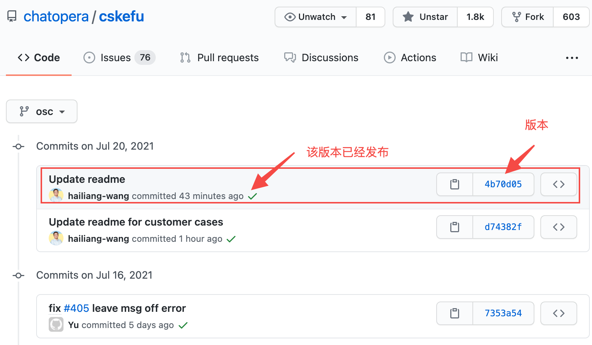
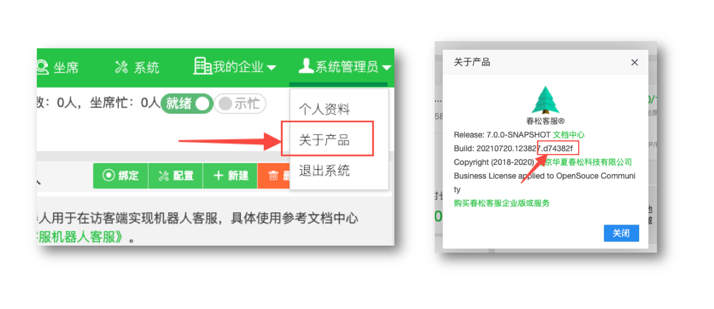

# 系统维护

以下文档基于[《春松客服私有部署》](https://docs.chatopera.com/products/cskefu/deploy.html)文档部署的案例，进行运维管理。

假设春松客服部署目录为：_ROOT_PATH/cskefu.osc_。以下脚本假设部署服务器为 Linux 或包含 Bash 环境的 Windows 服务器，使用 Bash Shell 运行脚本。

## 注意事项及官方声明

**！！！ 如果您在使用其它部署方案，或者在官方基础上更新过春松客服的源代码，以下文档并不一定适用。**

**运维需谨慎，尽量了解每个步骤的目的和结果，在操作前，如果使用虚拟化环境，请给服务器做快照！！！**

**作为一个给开发者社区提供的维护文档，我们的维护指南不承担法律责任，不承担经济责任。如需要专业的商业支持，请联系[春松客服官方团队](https://www.chatopera.com/mail.html)。**

## 关于春松客服版本号

_ROOT_PATH/cskefu.osc/.env_(以下简称 _.env_) 文件作为配置春松客服版本和环境变量的文件，也记录着 Docker 启动春松客服的版本信息，该文件在[部署阶段](/products/cskefu/deploy.html)创建。

```
CC_IMAGE=chatopera/contact-center:develop
```

在开源版本中，镜像的名字是 `chatopera/contact-center`，默认的版本是 `develop`，所有可选的版本在 [GitHub](https://github.com/chatopera/cskefu/commits/osc) 中可以浏览到：

<p align="center">

</p>

https://github.com/chatopera/cskefu/commits/osc

为了方便管理，春松客服 Git Commit Short ID 也是春松客服 Docker 镜像的 Tag，也常用 Docker 镜像版本号来指代。**在 GitHub** Commit 历史中，有对号的版本就是完成了对应的 Docker 镜像发布的版本，`develop` 标签就是已经发布的最近的版本。

比如，在上图中，`chatopera/contact-center:develop` 就代表 `chatopera/contact-center:4b70d05`。`chatopera/contact-center:develop` 对应的 Docker 容器会变化，但是用 Commit Short ID 的版本号对应的容器和代码一一对应，是不变的。

在春松客服实例中，也可以得到版本信息。作为春松客服系统用户登录，并在右上角用户名下拉菜单中，打开【关于产品】。

<p align="center">

</p>

在 `build` 的最后几位字符串就是版本号。

## 系统备份

### 设置版本号到配置文件

设置春松客服容器版本到 .env。

```
cd ROOT_PATH/cskefu.osc
vi .env         # 使用文本编辑器编辑
```

找到修改或添加

```
CC_IMAGE=chatopera/contact-center:YOUR_VERSION
```

将 `YOUR_VERSION` 替换为春松客服版本号，此处不要使用 `develop`，而必须是 Git Commit Short ID，原因见上文。

### 运行脚本

作为备份的文件，是和春松客服 Docker 容器版本绑定的，在完成了以上步骤后，执行下面的脚本。

```
TIMESTAMP=$(date +%Y%m%d_%H%M)
cd ROOT_PATH/cskefu.osc
docker-compose down # 停止服务
cd ../              # 来到父级目录
tar czfp cskefu.osc.$TIMESTAMP.tgz cskefu.osc # 打包备份
```

其中，tar 命令执行了将应用文件夹归档为【保留文件访问权限】的压缩包。

## 系统升级

基于 Docker 容器的系统升级，过程也很简单，因为春松客服发布的版本中，每次重启，都会校验数据库的版本匹配，自动维护数据库的表结构，比如新版本中增加了字段、删除了字段等，都会自动完成。这也是 Chatopera 团队推荐开发者/企业使用春松客服官方镜像的主要原因：部署、运维更简单。

### 系统备份

春松客服升级为【就地升级/ In Place Upgrade】，首先按照系统备份过程备份，以防升级后遇到问题无法回退。

### 获取最新的春松客服版本

参考前文【关于春松客服版本号】获得春松客服最新的版本信息，然后执行以下操作。

```
cd ROOT_PATH/cskefu.osc
docker-compose down       # 停止服务
vi .env      # 打开配置文件
```

找到修改或添加

```
CC_IMAGE=chatopera/contact-center:YOUR_VERSION
```

将 `YOUR_VERSION` 替换为春松客服新的版本号。

```
cd ROOT_PATH/cskefu.osc
docker-compose up -d     # 重启服务，此时，docker 会自动拉取新版本的镜像
```

## 回滚到系统备份

假设备份文件压缩包的位置是：`/root/cskefu.osc.202107001.tgz`。

```
cd ROOT_PATH/cskefu.osc
docker-compose down
cd ..
mv cskefu.osc cskefu.osc.backup # 将当前的文件存放在临时位置（万一还会用到，只是以防有可能用到）
tar xzfp /root/cskefu.osc.202107001.tgz # 备份文件被解压到 ROOT_PATH/cskefu.osc
cd ROOT_PATH/cskefu.osc
docker-compose up -d    # 启动服务
docker-compose logs -f contact-center # 查看日志
```

在春松客服运行后，在浏览器内访问并验证服务正常。升级完毕。
当系统可以稳定运行，比如 2 个月，再酌情删除 `cskefu.osc cskefu.osc.backup`。

## 下一步

- [观看春松客服大讲堂学习运营及定制客服系统](/products/cskefu/osc/training.html)

- [搭建开发环境](/products/cskefu/osc/engineering.html)

## 评论

<script src="https://utteranc.es/client.js"
        repo="chatopera/docs"
        issue-term="pathname"
        label="Comment"
        theme="github-light"
        crossorigin="anonymous"
        async>
</script>
