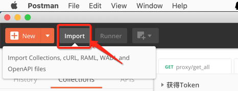

# REST APIs

春松客服目前具备 30 余个 RESTful API 接口，包括联系人管理，授权，获得访客会话列表等，方便企业/开发者从不同系统中集成春松客服。

## 安装 Postman

查看、测试和体验春松客服 API 需要安装 Postman， 并导入春松客服 API Collection 文件。

[Postman](https://www.postman.com/) 支持各种操作系统，免费下载安装包并使用：

[https://www.postman.com/](https://www.postman.com/)

## 导入 Collection

导入春松客服 API Collection，下载[Chatopera_cc_v1.postman_collection.20200312.zip](https://github.com/chatopera/cosin/files/4323043/Chatopera_cc_v1.postman_collection.20200312.zip)

将 zip 文件解压，得到 `Chatopera_cc_v1.postman_collection.json`。

打开 Postman，执行导入

<p align="center">

</p>

每个 API 在 Postman 中都有`Path`，`Body`，`Headers`等的设置，可查看示例和发送请求，对于开发人员来说非常友好。

## API 认证

导入 collection 文件后，从左侧找到 **Chatopera_cc_v1**

<p align="center">

</p>

认证接口：

```
# 获得Token
POST http://IP:PORT/tokens?username=USERNAME&password=PASSWORD
```

| key      | 描述         |
| -------- | ------------ |
| IP       | 春松客服 IP  |
| PORT     | 春松客服端口 |
| USERNAME | 用户名       |
| PASSWORD | 密码         |

回复结果为一个字符串，即 Auth token。

## API 请求

在请求其它 API 时，在 header 中设置`authorization`为 Auth token 就可以，如下：

<p align="center">

</p>

部分接口：

- 获得登录用户

- 联系人笔记：创建/删除/更新

- 机器人客服：创建/查询

针对每个接口的描述，此处不赘述，请直接用 Postman 查看。

## 注意事项

- 每个 token 有效期为 24 小时，认证失败会有相应提醒
- 登录用户的权限有限制，API 访问受此约束

## 评论

<script src="https://utteranc.es/client.js"
        repo="chatopera/docs"
        issue-term="pathname"
        label="Comment"
        theme="github-light"
        crossorigin="anonymous"
        async>
</script>
