# 会话历史

会话历史作为客服主管的运营工具，主要展示客服业务的数据和报表，同时也有一些数据是实时的，或通过时间选择器自定义时间段，形成数据分析和汇总。在[角色](https://docs.chatopera.com/products/cskefu/accounting.html)中，可以配置权限，指定登录用户的访问【会话历史】的权限。

## 历史会话

查看：左侧菜单 → 会话历史 → 历史会话

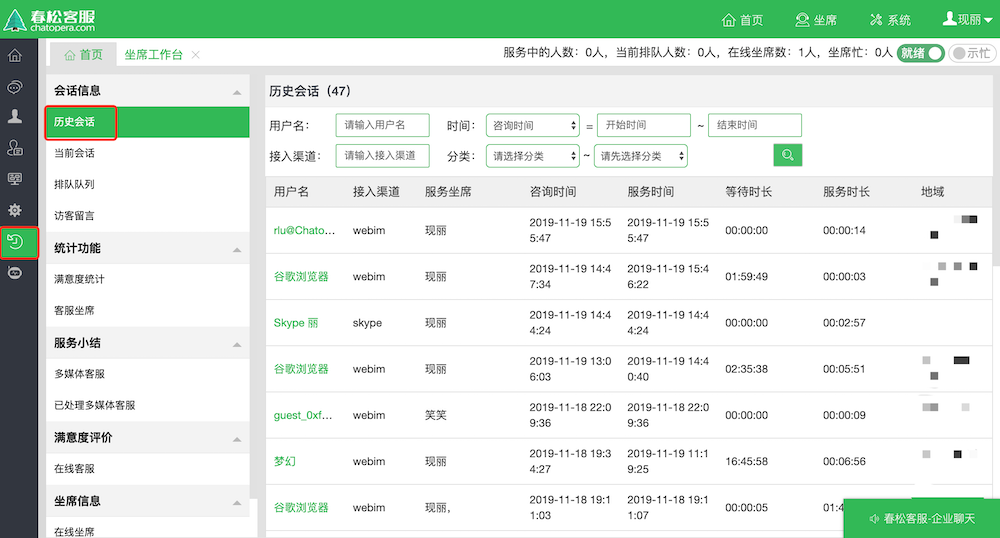

## 当前会话

查看：左侧菜单 → 会话历史 → 当前会话

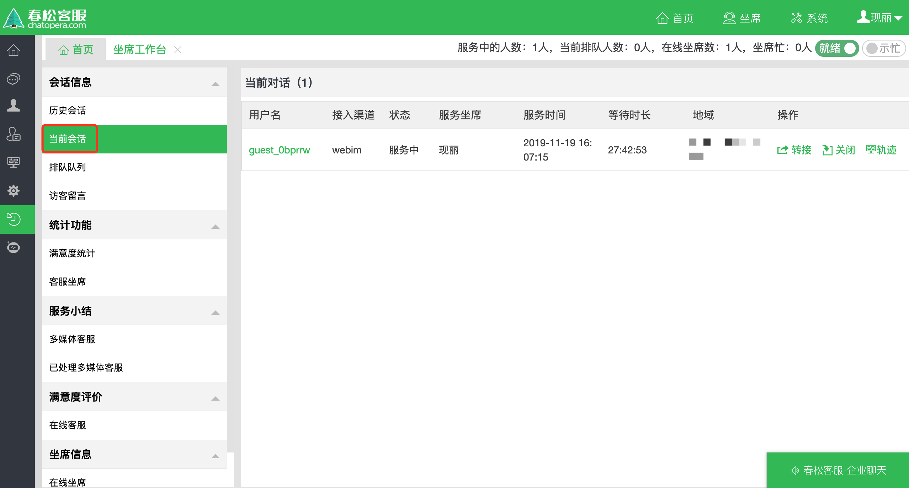

## 排队队列

查看：左侧菜单 → 会话历史 → 排队队列

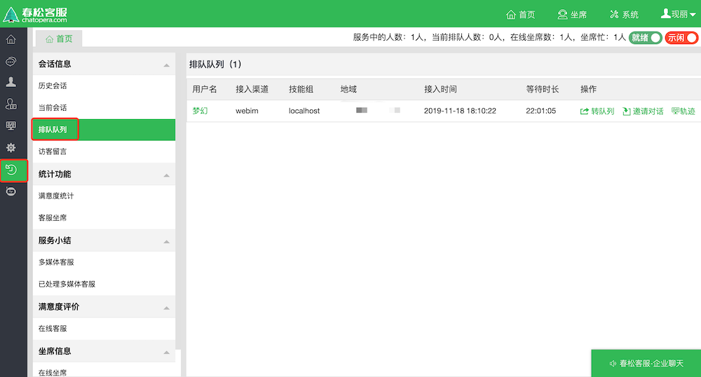

## 访客留言

查看：左侧菜单 → 会话历史 → 访客留言

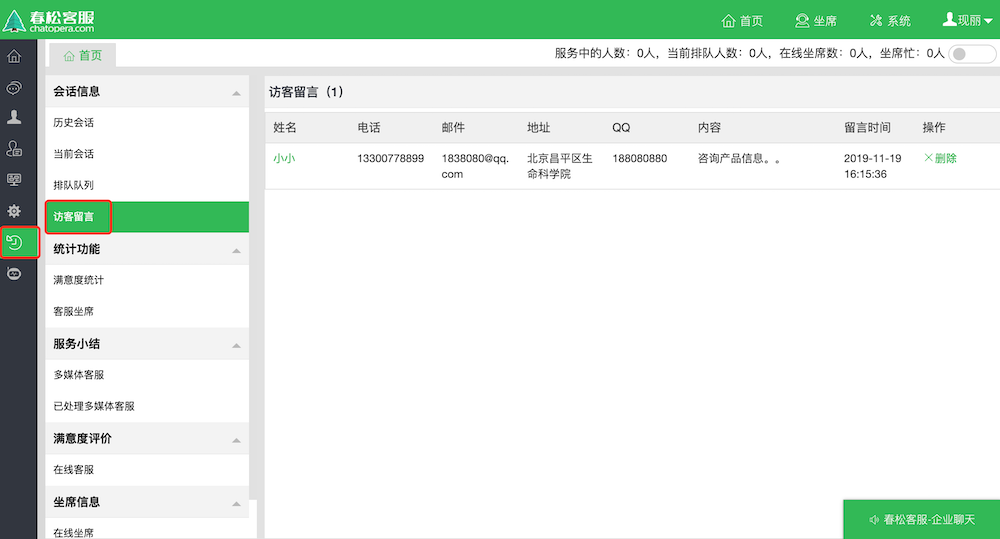

## 满意度统计

查看：左侧菜单 → 统计功能 → 满意度统计

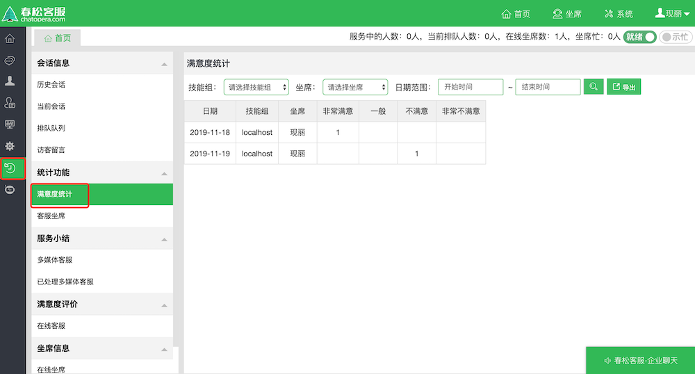

## 客服坐席

查看：左侧菜单 → 统计功能 → 客服坐席

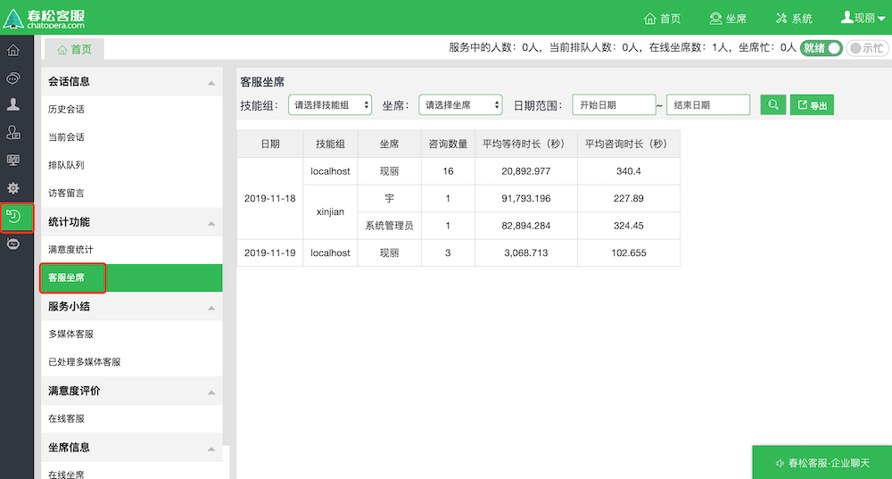

## 服务小结

查看：左侧菜单 → 服务小结 → 多媒体客服

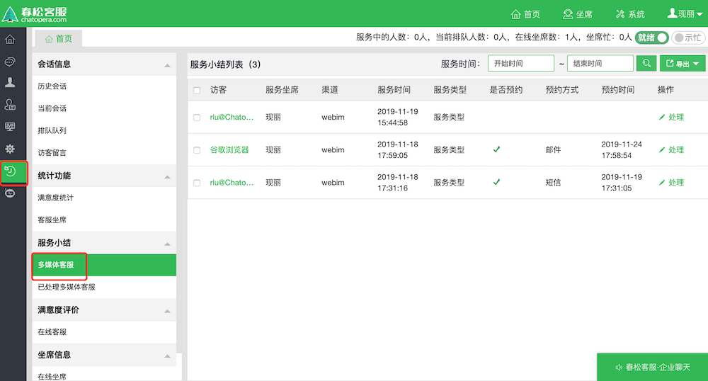

## 已处理服务小结

查看：左侧菜单 → 服务小结 → 已处理多媒体客服

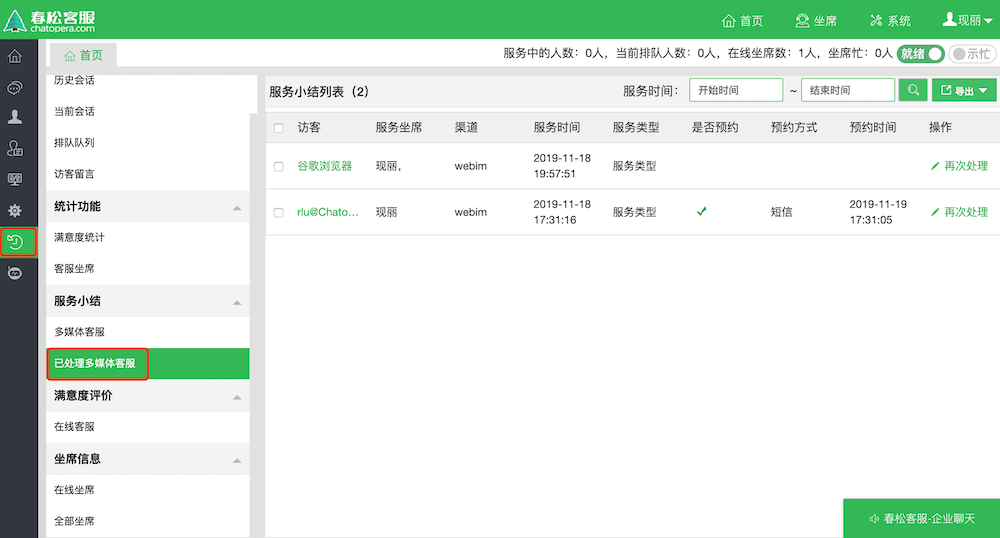

## 满意度评价

查看：左侧菜单 → 满意度评价 → 在线客服

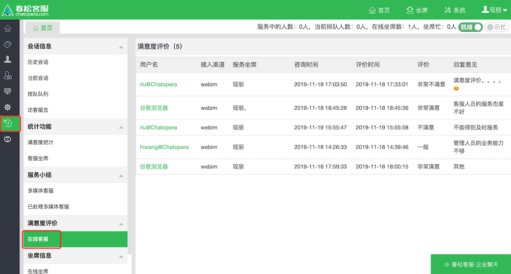

## 在线坐席

查看：左侧菜单 → 坐席信息 → 在线坐席

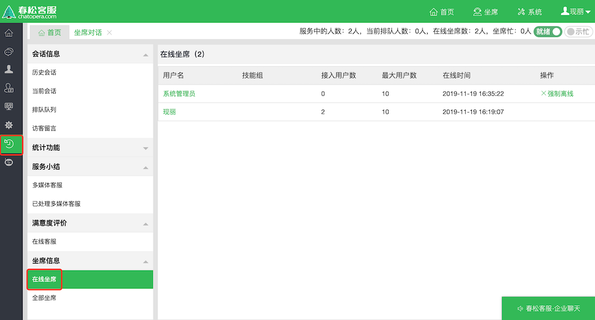

## 全部坐席

查看：左侧菜单 → 坐席信息 → 全部坐席

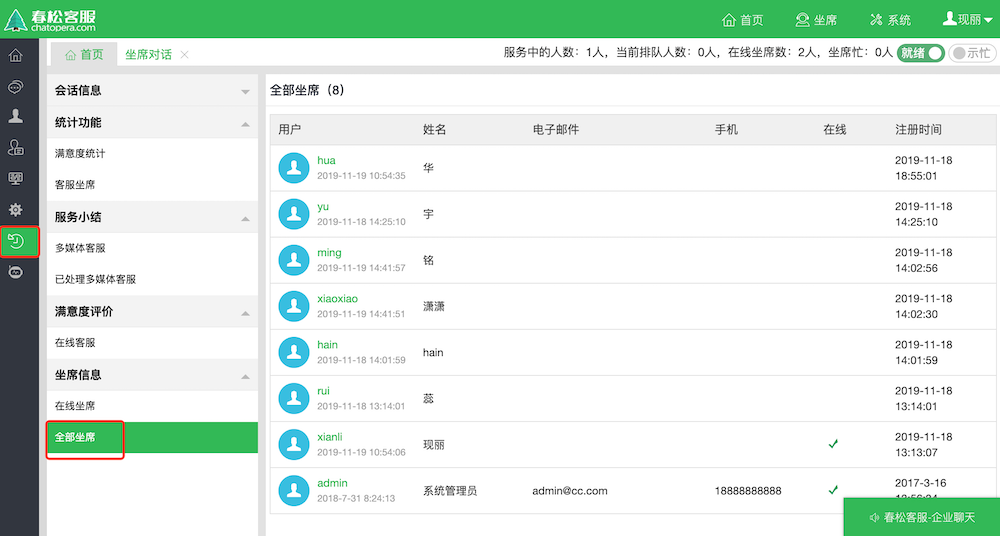

## 评论

