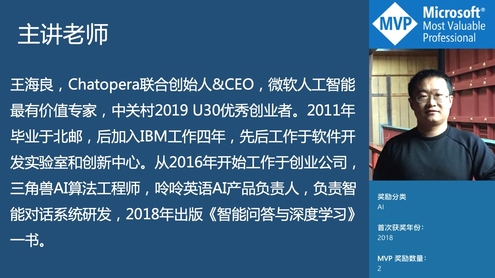

# 使用培训

春松客服大讲堂是面向企业 CTO、客服主管、客服及客服系统开发运维人员的在线课程，紧紧围绕春松客服开源代码，由浅入深的介绍春松客服**上线智能客服系统**、**运营客服工作**和**二次开发**的知识。

<table class="image">
    <tr>
        <td></td>
    </tr>
</table>

## 课程介绍

[《春松客服大讲堂》](https://ke.qq.com/course/464050)

<table>
  <tr>
    <th>章</th>
    <th>小节</th>
    <th>时长（时:分:秒）</th>
  </tr>
  <tr>
    <td rowspan="3">一、春松客服的介绍</td>
    <td><a href="https://ke.qq.com/webcourse/index.html#cid=464050&term_id=100555327&taid=4785478331471026&type=1024&vid=5285890796113543115">【免费】如何使用Java开发智能客服系统</a></td>
    <td>00:32:11</td>
  </tr>
  <tr>
    <td><a href="https://ke.qq.com/webcourse/index.html#cid=464050&term_id=100555327&taid=4785482626438322&type=1024&vid=5285890796174208504">【免费】春松客服在企业的落地</a></td>
    <td>00:30:41</td>
  </tr>
  <tr>
    <td><a href="https://ke.qq.com/webcourse/index.html#cid=464050&term_id=100555327&taid=4785486921405618&type=1024&vid=5285890796206187829">春松客服的技术介绍</a></td>
    <td>01:09:30</td>
  </tr>
  <tr>
    <td rowspan="7">二、客服相关的基本知识</td>
    <td><a href="https://ke.qq.com/webcourse/index.html#cid=464050&term_id=100555327&taid=4785491216372914&type=1024&vid=5285890796236118691">客服的日常工作</a></td>
    <td>00:57:35</td>
  </tr>
  <tr>
    <td><a href="https://ke.qq.com/webcourse/index.html#cid=464050&term_id=100555327&taid=4785495511340210&type=1024&vid=5285890796265703352">客服的基本知识</a></td>
    <td>00:46:48</td>
  </tr>
  <tr>
    <td><a href="https://ke.qq.com/webcourse/index.html#cid=464050&term_id=100555327&taid=4785499806307506&type=1024&vid=5285890796295538521">账号体系-权限，部门和角色</a></td>
    <td>00:42:06</td>
  </tr>
  <tr>
    <td><a href="https://ke.qq.com/webcourse/index.html#cid=464050&term_id=100555327&taid=4785504101274802&type=1024&vid=5285890796326774174">坐席会话的工具-拉黑，服务小结和转接</a></td>
    <td>00:33:00</td>
  </tr>
  <tr>
    <td><a href="https://ke.qq.com/webcourse/index.html#cid=464050&term_id=100555327&taid=4785508396242098&type=1024&vid=5285890796387973179">即时通信及坐席自动分配</a></td>
    <td>00:56:50</td>
  </tr>
  <tr>
    <td><a href="https://ke.qq.com/webcourse/index.html#cid=464050&term_id=100555327&taid=4785538461013170&type=1024&vid=5285890796727947677">企业聊天与人工质检</a></td>
    <td>00:35:12</td>
  </tr>
  <tr>
    <td><a href="https://ke.qq.com/webcourse/index.html#cid=464050&term_id=100555327&taid=4785542755980466&type=1024&vid=5285890796727887112">统计报表和满意度评价</a></td>
    <td>00:37:18</td>
  </tr>
  <tr>
    <td rowspan="6">三、春松客服的上线及维护</td>
    <td><a href="https://ke.qq.com/webcourse/index.html#cid=464050&term_id=100555327&taid=4785512691209394&type=1024&vid=5285890796417069415">春松客服的编译和部署</a></td>
    <td>00:38:27</td>
  </tr>
  <tr>
    <td><a href="https://ke.qq.com/webcourse/index.html#cid=464050&term_id=100555327&taid=4785516986176690&type=1024&vid=5285890796447482734">春松客服的运维管理</a></td>
    <td>01:00:37</td>
  </tr>
  <tr>
    <td><a href="https://ke.qq.com/webcourse/index.html#cid=464050&term_id=100555327&taid=4785521281143986&type=1024&vid=5285890796596887008">春松客服的自动化系统测试（1）</a></td>
    <td>00:32:45</td>
  </tr>
  <tr>
    <td><a href="https://ke.qq.com/webcourse/index.html#cid=464050&term_id=100555327&taid=4785534166045874&type=1024&vid=5285890796596824768">春松客服的自动化系统测试（2）</a></td>
    <td>00:49:20</td>
  </tr>
  <tr>
    <td><a href="https://ke.qq.com/webcourse/index.html#cid=464050&term_id=100555327&taid=4785525576111282&type=1024&vid=5285890796625584882">春松客服的压力测试（1）</a></td>
    <td>00:42:33</td>
  </tr>
  <tr>
    <td><a href="https://ke.qq.com/webcourse/index.html#cid=464050&term_id=100555327&taid=4785529871078578&type=1024&vid=5285890796625353569">春松客服的压力测试（2）</a></td>
    <td>00:40:39</td>
  </tr>
  <tr>
    <td rowspan="3">四、春松客服的机器人客服</td>
    <td><a href="https://ke.qq.com/webcourse/index.html#cid=464050&term_id=100555327&taid=4785564230816946&type=1024&vid=5285890797022829695">Chatopera云服务介绍</a></td>
    <td>00:28:01</td>
  </tr>
  <tr>
    <td><a href="https://ke.qq.com/webcourse/index.html#cid=464050&term_id=100555327&taid=4785568525784242&type=1024&vid=5285890797022829724">机器人的知识库管理</a></td>
    <td>00:47:56</td>
  </tr>
  <tr>
    <td><a href="https://ke.qq.com/webcourse/index.html#cid=464050&term_id=100555327&taid=4785572820751538&type=1024&vid=5285890797022759383">机器人的多轮对话及富文本消息类型</a></td>
    <td>00:43:32</td>
  </tr>
  <tr>
    <td rowspan="8">五、春松客服开发基础知识</td>
    <td><a href="https://ke.qq.com/webcourse/index.html#cid=464050&term_id=100555327&taid=4785547050947762&type=1024&vid=5285890796845383231">SQL快速入门</a></td>
    <td>00:46:39</td>
  </tr>
  <tr>
    <td><a href="https://ke.qq.com/webcourse/index.html#cid=464050&term_id=100555327&taid=4785551345915058&type=1024&vid=5285890796845241957">春松客服数据库表及管理</a></td>
    <td>00:45:30</td>
  </tr>
  <tr>
    <td><a href="https://ke.qq.com/webcourse/index.html#cid=464050&term_id=100555327&taid=4785555640882354&type=1024&vid=5285890796905914800">Java编程基础（1）</a></td>
    <td>00:45:24</td>
  </tr>
  <tr>
    <td><a href="https://ke.qq.com/webcourse/index.html#cid=464050&term_id=100555327&taid=4785559935849650&type=1024&vid=5285890796905985344">Java编程基础（2）</a></td>
    <td>01:37:53</td>
  </tr>
  <tr>
    <td><a href="https://ke.qq.com/webcourse/index.html#cid=464050&term_id=100555327&taid=4785585705653426&type=1024&vid=5285890796934211686">Maven项目管理</a></td>
    <td>00:46:18</td>
  </tr>
  <tr>
    <td><a href="https://ke.qq.com/webcourse/index.html#cid=464050&term_id=100555327&taid=4785590000620722&type=1024&vid=5285890796934221816">搭建春松客服开发环境</a></td>
    <td>01:10:28</td>
  </tr>
  <tr>
    <td><a href="https://ke.qq.com/webcourse/index.html#cid=464050&term_id=100555327&taid=4785581410686130&type=1024&vid=5285890797139512901">SpringBoot快速入门</a></td>
    <td>00:45:50</td>
  </tr>
  <tr>
    <td><a href="https://ke.qq.com/webcourse/index.html#cid=464050&term_id=100555327&taid=4785577115718834&type=1024&vid=5285890797139362028">项目源码讲解</a></td>
    <td>01:09:40</td>
  </tr>
  <tr>
    <td rowspan="2">六、春松客服的插件</td>
    <td><a href="https://ke.qq.com/webcourse/index.html#cid=464050&term_id=100555327&taid=4785602885522610&type=1024&vid=5285890797257275471">插件机制设计</a></td>
    <td>00:45:51</td>
  </tr>
  <tr>
    <td><a href="https://ke.qq.com/webcourse/index.html#cid=464050&term_id=100555327&taid=4785611475457202&type=1024&vid=5285890797257385985">春松客服机器人插件解读</a></td>
    <td>00:41:20</td>
  </tr>
  <tr>
    <td>七、总结</td>
    <td><a href="https://ke.qq.com/webcourse/index.html#cid=464050&term_id=100555327&taid=4785611475457202&type=1024&vid=5285890797257385985">春松客服团队介绍及课程总结</a></td>
    <td>00:32:11</td>
  </tr>
</table>

**提示**：本在线课程使用腾讯课堂服务；课程包括免费内容和付费内容，购买后可联系电话(+86)153-3009-0229 开发票；课程内容以下面标题为准，腾讯课堂上的标题与真实内容不完全匹配。

课程下线时间参考[页面](https://ke.qq.com/course/464050)内的上课时间，逾期后课程下线。使用 QQ 购买课程后会自动拉入课程咨询群，遇到问题可在群内交流。

## 优惠方案

春松客服大讲堂因为主要是指导中小型企业上线智能客服系统，我们在开发春松客服，运营开源社区，以及制作课程中投入心血，相对于丰富的内容以及全面知识体系而言，现在的定价`518RMB`是相对公道的，同时为了回馈那些对春松客服作出贡献的社区朋友、在校大学生等，我们制定了一个春松客服大讲堂优惠方案。

### 在校大学生五折

在校大学生五折优惠，需提交该优惠[申请表单](http://chatopera.mikecrm.com/2x0q47p)，提供`姓名`、`手机号`、`QQ号码`、`学校`、`入学时间`、`学生证电子版`信息。

### 提交 BUG

给春松客服开 issue 并被官方认定为 bug 或增强，每个被认定的[Issue](https://github.com/chatopera/cosin/issues)优惠`50元`，可以多个。

### 提交新需求

创建 issue 并被官方认定为新需求的，有较为具体的描述，每个[Issue](https://github.com/chatopera/cosin/issues)优惠`20元`。

### 推广文章

写关于春松客服的博客在 CSDN，cnblog 等开发者社区浏览量超 100 的，每篇博客优惠`50元`，最多支持 3 篇。

### 贡献代码

给春松客服提交[PullRequest](https://github.com/chatopera/cosin/pulls)并被官方合并，优惠`100元`，可以多个。

### 优惠条件

- 以上优惠条件支持叠加

- 当优惠后价格降至 0 元或以下，按 0 元计算

- 以上方案从今天开始至[《春松课堂大讲堂｜第一期》](https://ke.qq.com/course/464050)报名截止日期内有效

- 对于完成报名的课程学员，不再根据优惠方案返还费用

以上。

### 优惠使用

报名前和课程顾问联系，说明贡献，然后可获得优惠券，在购买[《春松课堂大讲堂｜第一期》](https://ke.qq.com/course/464050)时填写优惠券。

### 课程顾问联系方式

QQ: 1760028375
手机号：(+86)136-9149-0568
邮箱：info@chatopera.com

## 评论

