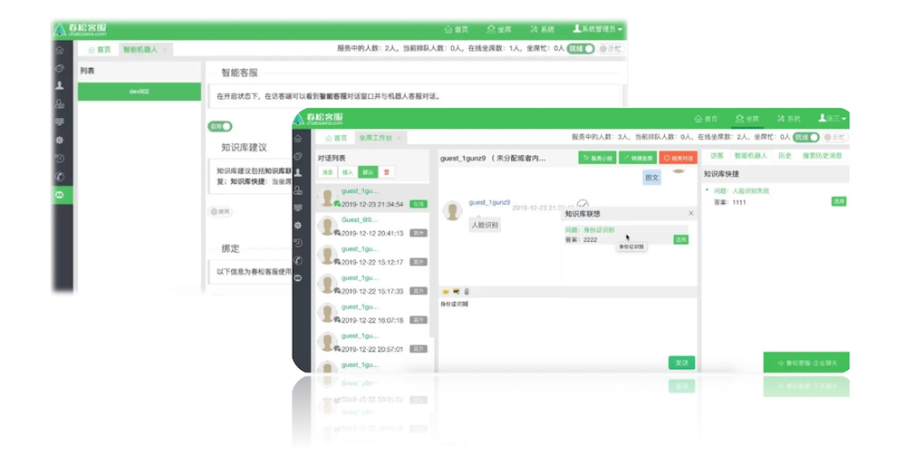

# 机器人客服

企业需要快速回复客服问题，当前市场上，存在很多厂商能提供全渠道智能客服系统，相对来说，渠道对接已经非常成熟，集成起来容易。在机器人客服上，用户体验参差不齐。在
Chatopera，我们主要关注智能机器人，追求最好的机器人客服体验：快速实现符合业务需求的聊天机器人，效果稳定。

<table class="image">
    <caption align="bottom">用户服务环节</caption>
    <tr>
        <td></td>
    </tr>
</table>

在 Chatopera，客服机器人将加入到聊天室中，它有两种参与客户服务的方式：

### 接管聊天室，直接和消费者沟通

<table class="image">
    <caption align="bottom">机器人客服</caption>
    <tr>
        <td></td>
    </tr>
</table>

具体地说，在排队阶段，引导消费者问问题，借助<a href="https://docs.chatopera.com/products/chatbot-platform/index.html"
    target="_blank">Chatopera 机器人平台</a>，进行意图识别，如果意图匹配到了智能问答引擎中的对话，就启动多轮对话，完成服务；未匹配到多轮对话则继续排队，在客服人员接入会话时，机器人客服针对消费者的问题，给客服人员建议回复。

**针对不同企业客户的需求，机器人客服的服务方式也可以调整，最主要的是，机器人客服可以利用多轮对话和知识库，提高用户满意度，提高效率，人工坐席专注于更加棘手的问题。**

### 辅助客服人员

<table class="image">
    <caption align="bottom">机器人辅助坐席</caption>
    <tr>
        <td></td>
    </tr>
</table>

利用机器人知识库，可以支持坐席即时获得建议回复，得到标准、准确、体贴的回复内容，提升用户体验，大幅度提升工作效率。在春松客服中，支持使用知识库完成：知识库快捷和知识库联想，详细内容阅读下文。

此外，考虑到客服工作目前分布在不同渠道，而且每隔一段时间还会出现新的渠道，有没有一个好的知识库工具能适应不同渠道呢？Chatopera 开发 [Chatopera 小助手](/products/chatbot-platform/faq.html#知识库小助手) 来适应差异较大的不同渠道，将机器人知识库发挥更大作用。

## 视频教程

机器人客服是春松客服的特色功能之一，机器人客服设计的目标是自动完成固定话术和固定话术的问答。春松客服的机器人客服是从客服人员和访客两个角度展开的，提升生产力和客户满意度，比如智能建议回复、知识库问答和多轮对话。

建议先看[视频教程](https://ke.qq.com/course/475430)，再看本文剩余内容。

视频地址：[https://ke.qq.com/course/475430](https://ke.qq.com/course/475430)

## 机器人客服的主要功能

机器人客服的主要功能包括：1）智能客服，接待访客；2）知识库建议，包括知识库联想和知识库快捷。

<p>智能客服：在开启状态下，在访客端可以看到<b>智能客服</b>对话窗口并与机器人客服对话。 在管理页面，可切换工作状态，比如机器人客服优先、人工坐席优先或仅机器人客服。</p>

<p>知识库建议：包括<b>知识库联想</b>和<b>知识库快捷</b>。<b>知识库联想</b>：当坐席与访客进行对话过程中，坐席输入消息时是否得到机器人的建议回复；<b>知识库快捷</b>：当坐席与访客进行对话过程中，坐席收到访客的消息时是否得到机器人的建议回复。</p>

可以在机器人管理页面设置这些功能的开启状态，在右上角菜单进入机器人管理和使用统计情况查看页面。

## 安装插件及配置

### 安装插件

如果使用春松客服官方的 docker 镜像部署，则无需此步。对于开源社区用户，在下载春松客服源码并启动后，不能立即得到机器人客服菜单，需要先安装插件。

**安装插件文档 [https://github.com/chatopera/cskefu/tree/osc/public/plugins](https://github.com/chatopera/cskefu/tree/osc/public/plugins)**

<p align="center">
  <b>安装好机器人插件</b><br>
  
</p>

只有**超级管理员**可以在【系统设置】中配置机器人客服，超级管理员权限介绍参考[账号与权限](/products/cskefu/accounting.html)。

### 配置环境变量

在机器人客服问答中，会从 Chatopera 云服务检索答案，答案有时候也包含多条记录，怎么回答访客的问题按照如下策略。

1、 首先，每个答案包含与访客问题的相似度，该相似度在[0,1]区间，值越大二者越相似。

2、 最高的相似度的答案如何大于或等于 **最佳回复阀值** 时，机器人客服将直接发送答案给访客。

3、 如何 （_2_）中没有得到答案，那么则将相似度大于或等于 **建议回复阀值** 的记录，作为一个列表发送给访客。

<p align="center">
  <b>建议回复列表</b><br>
  
</p>

4、（_2_） 和 （_3_）都没有答案，则回复兜底回复。

以上，我们引入了 **最佳回复阀值** 和 **建议回复阀值** 的概念，这两个值的默认值分别为 0.8 和 0.6。在启动服务时，也可以通过环境变量修改他们，其中 **最佳回复阀值** 需要大于 **建议回复阀值** 。

- 环境变量

```
BOT_THRESHOLD_FAQ_BEST_REPLY # 最佳回复阀值
BOT_THRESHOLD_FAQ_SUGG_REPLY # 建议回复阀值
```

如果部署是按照文档[春松客服私有部署](/products/cskefu/deploy.html)进行，可以在 _.env_ 中设置配置项，参考 [sample.env](https://github.com/chatopera/cskefu/blob/osc/sample.env)。

## 创建网站渠道

以管理员身份*春松客服坐席工作台*，导航【系统-客服接入-网站列表-创建新网站】，按照如下内容设置网站渠道。

| 项目     | 值        | 描述            |
| -------- | --------- | --------------- |
| 网站名称 | localhost | 任意字符串      |
| 网站地址 | localhost | 网站的域名或 IP |

<p align="center">
  <b>创建网站渠道</b><br>
  
</p>

点击【立即提交】保存。

## 创建聊天机器人

登录[Chatopera 云服务](https://bot.chatopera.com/)，注册并在【控制台】中创建聊天机器人。

<p align="center">
  <b>创建聊天机器人</b><br>
  
</p>

| 项目       | 值         | 描述                         |
| ---------- | ---------- | ---------------------------- |
| 机器人名称 | 小 C       | 机器人的名字，创建后不能变更 |
| 描述       | 机器人客服 | 机器人的描述                 |
| 语言       | zh_CN      | 机器人的语言为中文           |

机器人具有多轮对话和知识库两个管理对话能力的组件，在创建好机器人后，创建一个问答对作为测试示例。点击【知识库】图标，点击【新建问题】。

<p align="center">
  <b>新建问答对</b><br>
  
</p>

| 项目 | 值                                                       | 描述       |
| ---- | -------------------------------------------------------- | ---------- |
| 问题 | 缴费年期变更后，佣金如何计算？                           | 问题的文本 |
| 答案 | 变更后仍有佣金的，按照变更后的年期对应的提佣率计算佣金。 | 问题的答案 |

点击【确定】。

集成机器人的方式是通过 SDK 创建机器人实例，使用机器人接口进行对话和查询等。机器人实例的认证和授权是通过*ClientId*和*Secret*完成，点击【设置】查看*ClientId*和*Secret*。

<p align="center">
  <b>查看ClientId和Secret</b><br>
  
</p>

## 集成机器人客服

以管理员身份*春松客服坐席工作台*，导航【智能机器人-新建机器人】，按照如下内容填入创建表单。

| 项目     | 值             | 描述                                                    |
| -------- | -------------- | ------------------------------------------------------- |
| 网站渠道 | localhost      | 根据网站地址选择网站渠道                                |
| ClientId | xxx            | [Chatopera 云服务 ClientId](https://bot.chatopera.com/) |
| Secret   | xxx            | [Chatopera 云服务 Secret](https://bot.chatopera.com/)   |
| 工作模式 | 机器人客服优先 | 目前支持【机器人客服优先】或【人工客服优先】两种类型    |
| 描述     | 机器人客服     | 对机器人的简要介绍                                      |

<p align="center">
  <b>集成机器人客服</b><br>
  
</p>

点击【保存】创建机器人，返回机器人列表页面，可以找到刚刚创建的机器人客服。

<p align="center">
  <b>开启机器人客服</b><br>
  
</p>

## 测试机器人客服

> 提示：春松客服访客测试端地址

```
http[s]://春松客服IP[:PORT]/testclient.html
```

使用浏览器打开*春松客服访客测试端*，并点击【在线客服】。在知识库设置好后，当访客在客户端问问题，匹配了知识库的问题后，机器人就自动回复。

比如输入：_缴费年期变更后，佣金如何计算？_，能得到在知识库中设置的答案。

<p align="center">
  <b>访客端和机器人对话</b><br>
  
</p>

如果想使机器人变得更加智能，需要参考关于[Chatopera 云服务](https://docs.chatopera.com/chatbot-platform.html)的更多介绍。

## 问候语

在默认情况下，机器人的问候语是在 Chatopera 云服务的机器人属性页面进行设置，该设置只支持简单的文本。

<p align="center">
  <b>设置机器人问候语</b><br>
  
</p>

<p align="center">
  <b>春松客服访客端</b><br>
  
</p>

访客登录进入客服聊天窗口往往是有一些问题要咨询的，所以更为合理的用户体验是将一些常见问题作为导航用途显示在问候语下面，比如这样：

<p align="center">
  <b>常见问题列表</b><br>
  
</p>

在春松客服里，为了支持各种丰富的对话场景，这些功能都是使用多轮对话配置。接下来的介绍假设您已经学习了[多轮对话设计器](https://docs.chatopera.com/products/chatbot-platform/conversation.html#%E5%A4%9A%E8%BD%AE%E5%AF%B9%E8%AF%9D%E8%AE%BE%E8%AE%A1%E5%99%A8)的内容，**如果您还没有学习这部分内容，建议先完成，大约需要
30 分钟时间**。

下面是支持在问候语中关联热门问题，进行导航的方法：

- 下载安装多轮对话设计器

<table class="image">
    <caption align="bottom">下载多轮对话设计器</caption>
    <tr>
        <td></td>
    </tr>
</table>

下载连接也可以通过[多轮对话设计器使用教程](https://docs.chatopera.com/products/chatbot-platform/conversation.html#%E4%B8%8B%E8%BD%BD%E5%9C%B0%E5%9D%80)获得。

- 新建聊天机器人

<table class="image">
    <caption align="bottom">新建聊天机器人</caption>
    <tr>
        <td></td>
    </tr>
</table>

- 新建对话技能

<table class="image">
    <caption align="bottom">新建对话技能</caption>
    <tr>
        <td></td>
    </tr>
</table>

此处，对话名称可以使用字母、数字和下划线组成的字符串填写。

- 粘贴技能脚本

在该机器人的技能列表中，点击刚刚创建的技能的“编辑”按钮，并在新打开的编辑窗口中，选择“脚本”，将下面的几行内容粘贴到编辑窗口中。

<pre class="prettyprint">
// FAQ Hotlist
+ __faq_hot_list
- ^get_greetings()
</pre>

点击【保存】，在编辑窗口中，如图。

<table class="image">
    <caption align="bottom">粘贴技能脚本</caption>
    <tr>
        <td></td>
    </tr>
</table>

该规则`__faq_hot_list`将保证在访客和机器人连接成功后，
机器人发送函数`get_greetings`返回的内容。此处`__faq_hot_list`是固定的，`get_greetings`函数名和下面的技能函数名保持一致便可。

- 粘贴技能函数

<pre class="prettyprint">
// 问候语中关联常见问题
exports.get_greetings = async function() {
    return {
        text: "请问有什么可以帮到您？",
        params: [{
            label: "1. 产品列表",
            type: "qlist",
            text: "产品列表"
        }, {
            label: "2. 当季热销产品",
            type: "qlist",
            text: "当季热销产品"
        }, {
            label: "3. 退换货咨询",
            type: "qlist",
            text: "退换货咨询"
        }]
    };
}  
</pre>

点击【保存】，在编辑窗口中，如图。

<table class="image">
    <caption align="bottom">粘贴技能函数</caption>
    <tr>
        <td></td>
    </tr>
</table>

在函数中，可以自定义热门问题的文字，顺序。文字即访客看到的文本内容，通过`label`设定，当访客点击一个问题时，聊天机器人将收到 `text`设定的文本。您可以在知识库或多轮对话中，设置该文本的回复内容。

访客对于热门问题列表，可以点击多次。

- 导出聊天机器人

多轮对话设计器是企业聊天机器人的设计环境，[Chatopera 云服务](https://docs.chatopera.com/chatbot-platform.html)或[智能问答引擎](https://docs.chatopera.com/chatbot-engine.html)是机器人的运行时环境。

<table class="image">
    <caption align="bottom">发布并导出对话应用</caption>
    <tr>
        <td></td>
    </tr>
</table>

导出后，多轮对话设计将该机器人多轮对话保存为一个`.c66` 后缀的文件。

- 发布聊天机器人

登录 Chatopera 云服务，在目标机器人的多轮对话管理面板中，导入对话应用(`.c66`)文件。

<table class="image">
    <caption align="bottom">导入Chatopera云服务</caption>
    <tr>
        <td></td>
    </tr>
</table>

- 上线后使用

在导入成功后，在春松客服中，访客再次登录聊天窗口，就会收到带有热门问题的问候语。

## 按钮消息

另外一种情况是机器人客服回答一个选择列表，访客点选按钮进行选择。

<table class="image">
    <caption align="bottom">按钮消息</caption>
    <tr>
        <td></td>
    </tr>
</table>

- 粘贴技能脚本

可以在上面步骤中建立的技能中，添加新的规则：

<pre class="prettyprint">
+ (*) 产品列表 (*)
- ^get_products()
</pre>

该规则将保证在访客的问题中有 `产品列表`时，发送函数`get_products`返回的内容。

- 粘贴技能函数

<pre class="prettyprint">
// 按钮选择消息
exports.get_products = async function() {
    return {
        text: "您对下面哪个产品感兴趣",
        params: [{
                label: "上衣",
                type: "button",
                text: "介绍一下上衣"
            },
            {
                label: "服装",
                type: "button",
                text: "介绍一下鞋帽"
            }
        ]
    }
}
</pre>

在脚本中，只需要设定`params`中的内容作为选型，其他保持默认。

## 图文消息

春松客服还支持的一类消息是图文消息，通过是分享一个链接，展示链接的图片和简介。

<table class="image">
    <caption align="bottom">按钮消息</caption>
    <tr>
        <td></td>
    </tr>
</table>

- 粘贴技能脚本

可以在上面步骤中建立的技能中，添加新的规则：

<pre class="prettyprint">
+ 介绍一下上衣
- ^get_shangyi()
</pre>

该规则将保证在访客的问题中有 `介绍一下上衣`时，发送函数`get_shangyi`返回的内容。

- 粘贴技能函数

<pre class="prettyprint">
// 图文消息
exports.get_shangyi = async function() {
    return {
        text: "{CLEAR} 图文消息",
        params: [{
            type: 'card',
            title: "秋冬上衣优选",
            thumbnail: "https://ss0.bdstatic.com/70cFuHSh_Q1YnxGkpoWK1HF6hhy/it/u=277597165,2202071991&fm=15&gp=0.jpg",
            summary: "秋冬上衣优选秋冬上衣优选秋冬上衣优选秋冬上衣优选秋冬上衣优选秋冬上衣优选秋冬上衣优选秋冬上衣优选",
            hyperlink: "https://www.1688.com/huo/B6F9CDAFD7B0C5AEBAA2CDE2CCD7BCD3BAF1C9CFD2C2C7EFB6AC.html"
        }]
    }
}
</pre>

其中，`title`代表大标题，`thumbnail`是图片，`summary`是简介，`hyperlink`是点击图文消息后，跳转的链接，这几项是用户可以自定义的，其它项就使用默认值，比如`type`的值必须是`card`。

文本消息、热门问题、按钮消息和图文消息是春松客服支持的在线机器人客服消息类型，更多知识进入 [Chatopera 机器人平台文档](/products/chatbot-platform/conversation.html#消息形式)查看。

在掌握了知识库、脚本语法和函数后，用户可以支持各种客服场景。

## 快速开始

在上面的介绍中，Chatopera 的多轮聊天机器人通过`c66`文件进行分发，Chatopera
提供了在问候语中关联热门问题的多轮对话应用示例文件(`小松.1.0.7.c66`)，您可以点击[下载链接](https://github.com/chatopera/chatopera.samples/raw/master/%E5%8D%A1%E7%89%87%E6%B6%88%E6%81%AF/%E5%B0%8F%E6%9D%BE.1.0.7.c66)获得这个应用。

该对话可以导入到多轮对话设计器中，进行浏览脚本和函数；也可以直接导入到 Chatopera 云服务，然后在春松客服中进行体验。

## 评论

<script src="https://utteranc.es/client.js"
        repo="chatopera/docs"
        issue-term="pathname"
        label="Comment"
        theme="github-light"
        crossorigin="anonymous"
        async>
</script>
