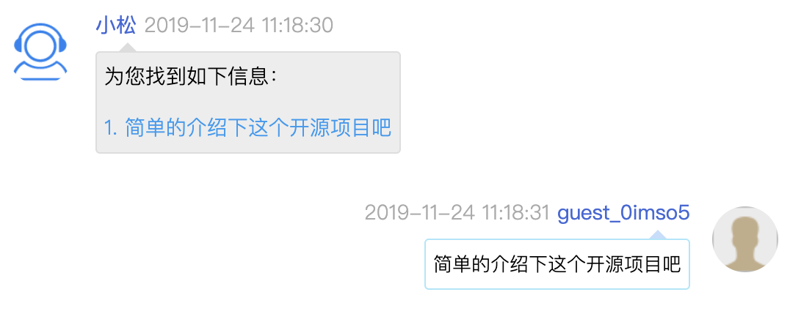

## 安装插件

如果使用春松客服官方的 docker 镜像部署，则无需此步。对于开源社区用户，在下载春松客服源码并启动后，不能立即得到机器人客服菜单，需要先安装插件。

**安装插件文档 [https://github.com/chatopera/cskefu/tree/osc/public/plugins](https://github.com/chatopera/cskefu/tree/osc/public/plugins)**

<p align="center">
  <b>安装好机器人插件</b><br>
  
</p>

只有**超级管理员**可以在【系统设置】中配置机器人客服，超级管理员权限介绍参考[账号与权限](/products/cskefu/accounting.html)。

## 配置环境变量

在机器人客服问答中，会从 Chatopera 云服务检索答案，答案有时候也包含多条记录，怎么回答访客的问题按照如下策略。

1、 首先，每个答案包含与访客问题的相似度，该相似度在[0,1]区间，值越大二者越相似。

2、 最高的相似度的答案如何大于或等于 **最佳回复阀值** 时，机器人客服将直接发送答案给访客。

3、 如何 （_2_）中没有得到答案，那么则将相似度大于或等于 **建议回复阀值** 的记录，作为一个列表发送给访客。

<p align="center">
  <b>建议回复列表</b><br>
  
</p>

4、（_2_） 和 （_3_）都没有答案，则回复兜底回复。

以上，我们引入了 **最佳回复阀值** 和 **建议回复阀值** 的概念，这两个值的默认值分别为 0.8 和 0.6。在启动服务时，也可以通过环境变量修改他们，其中 **最佳回复阀值** 需要大于 **建议回复阀值** 。

- 环境变量

```
BOT_THRESHOLD_FAQ_BEST_REPLY # 最佳回复阀值
BOT_THRESHOLD_FAQ_SUGG_REPLY # 建议回复阀值
```

如果部署是按照文档[春松客服私有部署](/products/cskefu/deploy.html)进行，可以在 _.env_ 中设置配置项，参考 [sample.env](https://github.com/chatopera/cskefu/blob/osc/sample.env)。

## 创建网站渠道

以管理员身份*春松客服坐席工作台*，导航【系统-客服接入-网站列表-创建新网站】，按照如下内容设置网站渠道。

| 项目     | 值        | 描述            |
| -------- | --------- | --------------- |
| 网站名称 | localhost | 任意字符串      |
| 网站地址 | localhost | 网站的域名或 IP |

<p align="center">
  <b>创建网站渠道</b><br>
  
</p>

点击【立即提交】保存。
