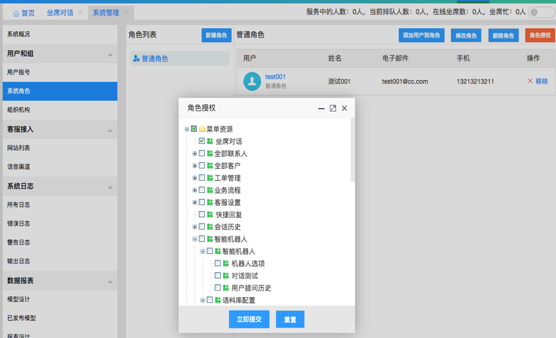

# 客服工作台

## 客服工作状态

客服人员和消费者建立连接，并完成对话的聊天室，是客服系统的核心之一。除了建立连接的速度，消费者的用户体验也是在聊天的过程中体现的，当服务场景需要智能化和自动化时，也是围绕聊天室进行的。因为不同客户的业务需求不同，聊天室针对业务需求有不同的设计，下图表示常见的状态：

<table class="image">
    <caption align="bottom">聊天室的状态</caption>
    <tr>
        <td></td>
    </tr>
</table>

`排队`：人工坐席繁忙，消费者接入聊天室时没有空闲的客服人员接起会话，这时，消费者往往会等待，在等待的过程中输入问题。此时消费者不能断开，断开后重连有可能重新排队。

`活动`：人工坐席加入会话，开始和消费者聊天，解答问题，并且有可能进行几句寒暄。

`转接`：当前服务人员有时会需要其他工作人员协助，往往也会直接将消费者转接到另外一名客服人员。这时，聊天室就被另外一名客服人员接管。

`关闭`：聊天结束后的一种状态，代表服务未顺利完成，很可能对消费者问题没有解决或消费者离开聊天室。

`完成`：聊天结束后的一种状态，代表服务顺利完成，比如消费者得到了满意的回答，关闭聊天室。

## 客服坐席设置

- 确保需要作为坐席的用户具有“多媒体坐席”的权限；系统->系统管理->用户和组->用户账号->选中该用户->编辑，就可以设置“多媒体坐席

<table class="image">
    <caption align="bottom"></caption>
    <tr>
        <td></td>
    </tr>
</table>

- 需要把 “坐席工作台” 授权给此用户；

<table class="image">
    <caption align="bottom"></caption>
    <tr>
        <td></td>
    </tr>
</table>

- 保证该坐席用户已经登录系统，并且将自己的坐席状态设置为”就绪”。

<table class="image">
    <caption align="bottom"></caption>
    <tr>
        <td></td>
    </tr>
</table>
