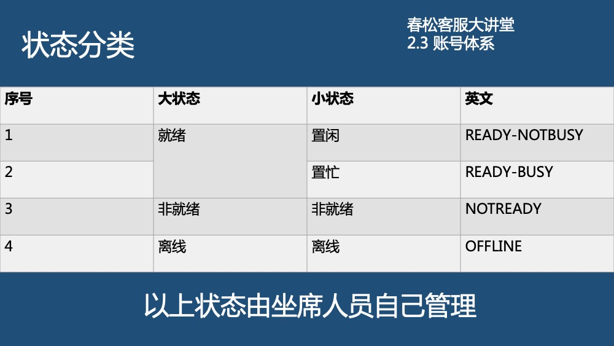
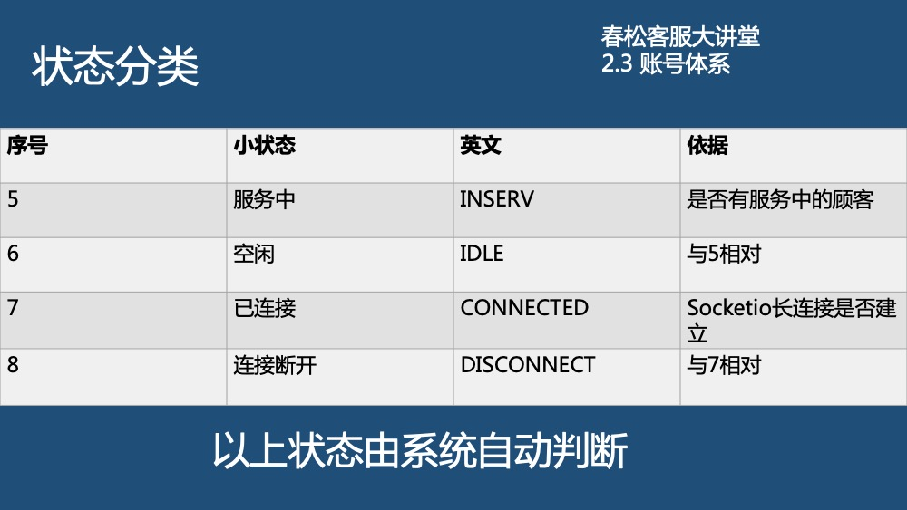
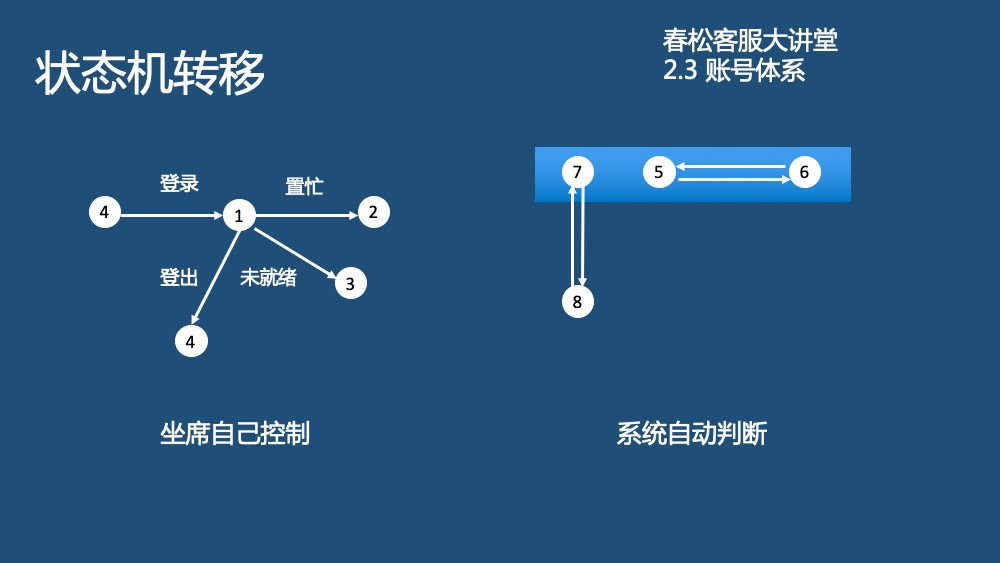

# 坐席工作台

坐席工作台，是坐席人员服务访客的主要工具，在左侧导航菜单可进入坐席工作台页面。进入坐席工作台后，客服人员可查看服务中、排队的访客，和访客交谈等。

## 客服工作状态

客服人员和消费者建立连接，并完成对话的聊天室，是客服系统的核心之一。参考以下内容，避免出现使用错误。

### 注意事项

客服人员状态设置应注意以下事项：

1. 登录后设定为“在线”，默认为“就绪置闲”。

2. 坐席设定“置忙”或“非就绪”。

3. 坐席只能单点登录，后续的登录会将早前的登录踢出。

4. 坐席可以在登录后打开多个 Tab 页。

5. 坐席关闭所有 Tab 页后：如果在 10 秒内没有打开新的 Tab 页，则系统自动设定该坐席为“非就绪”状态；如果坐席在 10 秒内打开新的 tab 页，则保持关闭 tab 页前的状态。

6. 坐席没有关闭所有 Tab 页，则保持关闭前的状态。

7. 坐席刷新 Tab 页，保持刷新前的状态：此处如果坐席持续不断的刷新 Tab 页，则有可能被系统设定到“非就绪状态”，这个符合客观事实，连续不断的刷就是非就绪。

8. 坐席登出，设定为离线状态。**离开电脑超过 1 个小时，坐席人员应设定为非就绪状态或置忙；在下班前，应登出春松客服。**

9. 坐席每次登录，有最大时效为 24 小时，超过 24 小时需要重新登录，否则执行转接等操作时会提醒并回到登录页面。

## 访客会话状态流转

在访客与人工坐席的会话中，状态流转如下：

 

`排队`：人工坐席繁忙，消费者接入聊天室时没有空闲的客服人员接起会话，这时，消费者往往会等待，在等待的过程中输入问题。此时消费者不能断开，断开后重连有可能重新排队。

`活动`：人工坐席加入会话，开始和消费者聊天，解答问题，并且有可能进行几句寒暄。

`转接`：当前服务人员有时会需要其他工作人员协助，往往也会直接将消费者转接到另外一名客服人员。这时，聊天室就被另外一名客服人员接管。

`关闭`：聊天结束后的一种状态，代表服务未顺利完成，很可能对消费者问题没有解决或消费者离开聊天室。

`完成`：聊天结束后的一种状态，代表服务顺利完成，比如消费者得到了满意的回答，关闭聊天室。

当该渠道集成了机器人客服时，对该流程有影响，参考[机器人客服](/products/cskefu/work-chatbot/index.html)。

## 客服坐席设置

- 确保需要作为坐席的用户具有“多媒体坐席”的权限；系统->系统管理->用户和组->用户账号->选中该用户->编辑，就可以设置“多媒体坐席

- 需要把 “坐席工作台” 授权给此用户；

- 保证该坐席用户已经登录系统，并且将自己的坐席状态设置为”就绪”。

