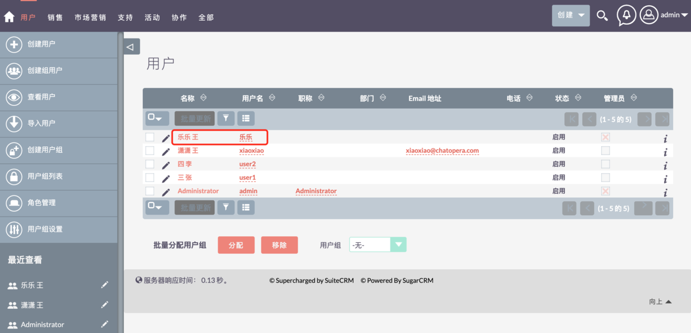
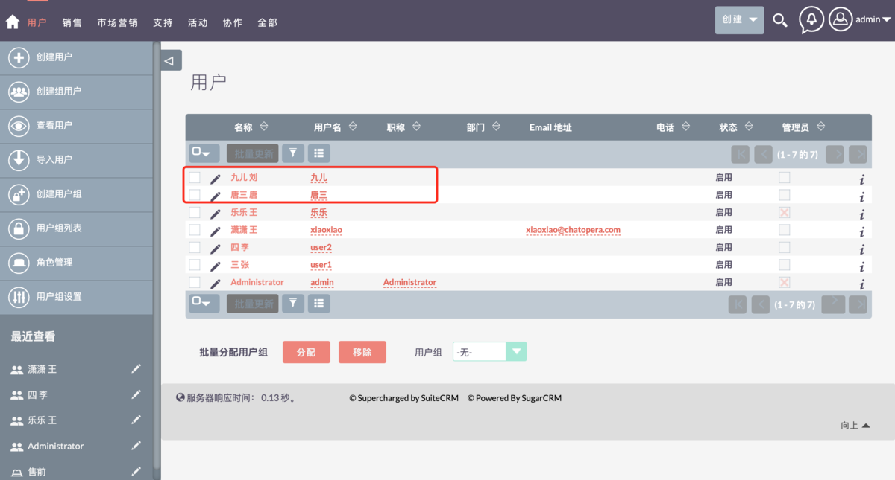

# 账号管理

根据角色和组进行权限检查：

- 管理员可以管理所有资源
- 管理员可以创建用户组/角色/人员，人员可设置为是否是“管理员”。
- 角色包含对不同资源的读写权限
- 资源如联系人，客户等是根据用户组进行隔离的

## 创建用户账号

### 创建管理员账号

系统管理员用户可以访问系统管理页面和所有的记录

步骤：登录管理员账号->「点击右上角"头像" > 」→「个人配置」→ 看到左侧「用户」

    

步骤：「用户」→「创建用户」→ 类型选择「系统管理员」

    

创建管理员账号成功页面

    

### 创建普通用户账号

步骤：参考上文创建步骤，选择用户类型为：普通用户

    

## 创建组用户

创建组用户用户将项目分配给组（例如：收件箱）此类型不能通过 CRM web 界面登录

    

保存后页面

    

可以在保存后的页面进行编辑和删除的操作，点击「动作」然后进行编辑或删除的操作，如果不在这个页面进行操作，也可以在用户列表页面进行编辑和删除

    

## 查看用户

### 查看用户列表

在「查看用户」页面可以看到每个用户的很多属性，比如：「用户名」、「职称」、「电话」等等。

步骤：用户->查看用户

    

### 查看用户信息

步骤：点击用户名进入用户信息页面

    

    

### 编辑用户信息

第一种方法：选择需要编辑的用户点击`编辑` 进入编辑页面编辑用户信息

    

    

第二种方法：在用户信息页面点击编辑，进入编辑页面

    

### 删除用户

步骤：在用户信息页面点击删除

    

## 导入用户

### 导入文件准备

准备要导入的数据文件，或者下载一个数据模板文件参考并创建一个数据文件。导入文件默认是「CSV」格式的文件。建议在导入之前最好是下载大盛 CRM 官方提供的模版，即点击`下载数据文件模版` 可以获取，请按照模版的说明操作，填入用户的数据。

    

### 选择导入文件

选择需要导入的文件，文件格式为.csv

    

    

### 确认导入文件属性

    

### 确认字段映射

    

### 检查重复数据

查看页面提示信息，如果没有问题，点击「现在导入」按钮

    

### 查看导入结果

    

## 用户组管理

### 创建用户组

步骤：在用户页面点击「创建用户组」进入「创建用户组」页面，添加用户组信息进行保存

    

    

### 用户组列表

步骤：点击「用户组列表」在用户组列表页面可以进行编辑、删除等操作

    

### 编辑用户组

步骤：点击`编辑`进入编辑页面

    

    

### 删除用户组

步骤：点击需要删除用户组前的选择框 → 批量操作->删除

    

### 用户组设置

    

## 角色管理

### 创建角色

步骤：个人配置->「用户」→「角色管理」→「创建角色」

    

    

### 角色列表

角色列表展示了系统已有角色，在角色列表页面可以对角色进行编辑、删除等操作。

    

### 编辑角色

方法 1：点击需要编辑的角色名称前的「编辑」进入角色编辑页面

    

    

方法 2：点击角色名称 → 编辑

    

    

    

### 角色授权

步骤：点击角色名称 → 进入角色授权页面，根据提示对角色权限进行修改或添加

    

### 删除角色

步骤：选择要删除的角色 → 批量操作 → 删除

    

### 根据用户列出角色

在根据用户列出角色页面，可以看到用户在系统的权限

    

    

    

