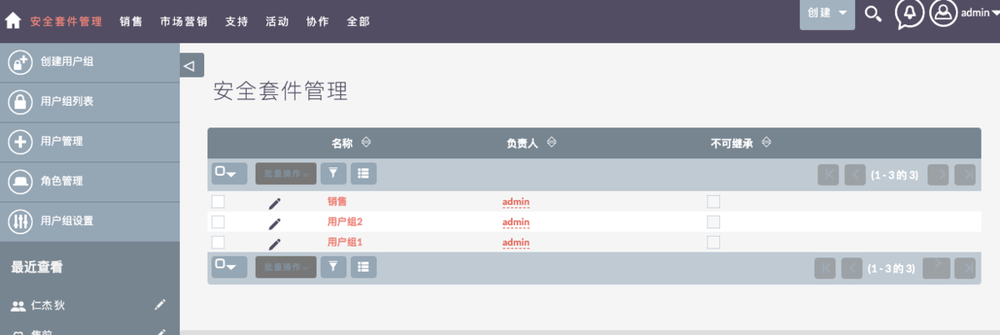

# 系统管理

## 用户管理

在大盛 CRM 系统中，「用户」与「员工」是同一个实体资源。用户可以登录到大盛 CRM 系统。 除了“员工”模块中包含的基本信息（名称，职务，地址，电话号码等）之外，用户还具有用户名和密码（使他们能够登录到系统）和电子邮件地址。 在大盛 CRM 中创建新用户时，将创建匹配的「员工」记录。 同样，当创建新的「员工」记录时，也会创建一个新的「用户」记录。 需要编辑一个用户记录（如果需要）以添加用户名/密码和电子邮件地址，然后才能用于登录大盛 CRM。

你必须具有管理员访问权限才能添加新的用户帐户和编辑访问设置。 普通用户可以访问自己的用户帐户的详细信息，并且可以编辑地址等详细信息，设置首选项，设置个人电子邮件和更改密码。
步骤：管理员 → 「系统管理」->「用户」→ 「用户管理」以查看，编辑和添加用户帐户。

    

    

### 创建用户

从边栏中选择「创建用户」以添加新用户帐户。

    

#### 用户信息标签

- 用户信息

在默认的用户个人资料标签页面上，输入新的用户名，用户的名字和姓氏以及帐户状态（启用或停用）。

从「用户类型」下拉列表中选择用户的类型。 系统管理员用户可以访问“管理”面板和大盛 CRM 中的所有记录。 普通用户可以根据分配给他们的角色访问模块和记录。

    

- 双重认证

可以给每个用户启用「双重认证」。 启用后，每次登录大盛 CRM 时，用户都需要输入电子邮件收到的验证码。

选中「双重认证」选择框以启用。

    

- 员工信息

    

- 电子邮件选项

    

#### 更改密码标签

- 更改密码

如果启用了“系统生成的密码”功能，则“密码”选项卡将在用户记录上不可见。 要启用/禁用系统生成的密码，请参阅文档的“密码管理”部分。

    

#### 高级标签

    

#### 布局选项标签

    

### 密码管理

在管理控制台中，选择密码管理以打开设置页面。

    

    

#### 系统生成密码

如果启用此功能，系统将自动生成用户帐户的密码，并通过电子邮件发送到该用户帐户上的地址。这要求同时配置电子邮件服务器和用户记录上的有效电子邮件地址。

    

#### 密码安全设置

这些是用户密码的可选密码安全设置。 设置后，用户密码必须符合所选条件。

    

#### 用户重置密码

    

#### 邮件模版

    

#### LDAP 身份验证

    

#### SAML 身份验证

    

### 角色管理

「角色」从“管理面板”的“用户”部分进行管理。
通过设置，您可以将大盛 CRM 中的敏感数据访问限制为特定的团队（组）。 有许多选项可让您根据实际需要进行配置，还有许多自动分配选项可确保您的用户始终可以访问所需的数据。

角色用于定义对模块的访问权限，并确定用户在有权访问记录后可以执行的操作。

    

    

#### 创建角色

输入「名称」与「说明」点击「保存」

    

创建角色后，将显示角色矩阵，其中显示了每个模块的所有可配置访问选项。

    

#### 角色列表

点击角色名称可以查看或者修改角色的访问权限
点击角色数据前面的「笔」icon 编辑角色名字和角色描述内容

    

### 用户组管理

「用户组」从“管理面板”的“用户”部分进行管理。

    

#### 创建用户组

    

#### 用户组列表

    

### 用户组设置

大盛 CRM 系统管理员可以为系统配置许多高级选项。 这使您可以控制各种访问权限、记录的继承和过滤器等。

    

    

## 评论

