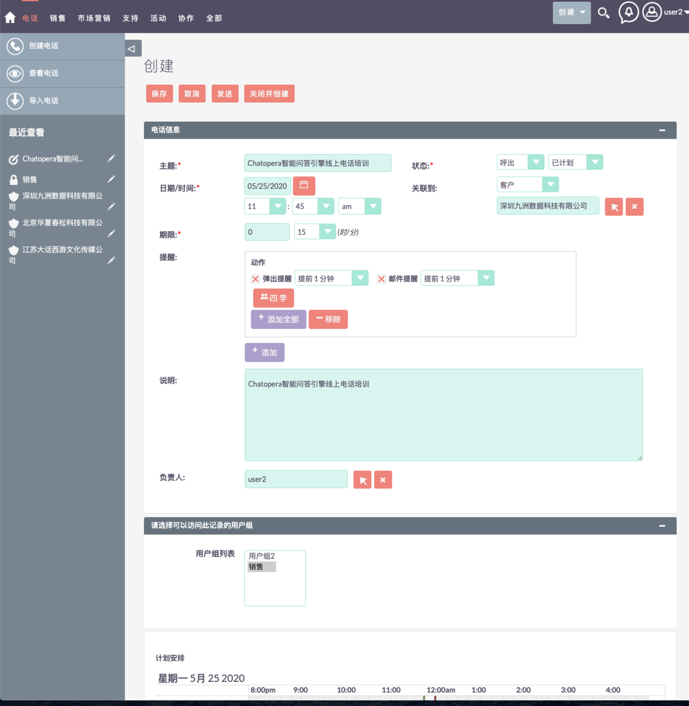
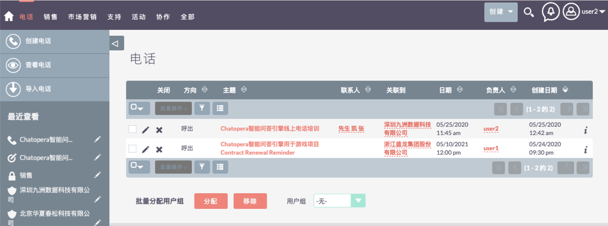

# 电话管理

大盛 CRM 中的「电话」模块允许用户安排和记录他们可能参与的呼入和呼出呼叫记录。

## 电话列表

电话模块：顶部菜单「全部」->「电话」

    

    

## 创建电话

可以创建一个新的电话

步骤：电话模块 → 创建电话

    

## 查看电话

可以查看所有的有权限的电话数据

步骤：电话模块 → 查看电话

    

## 导入电话

可以导入一批 csv 格式的电话数据

步骤：电话模块 → 导入电话

### 上传数据文件

    

### 确认导入文件属性

    

### 确认字段映射

    

### 检查重复数据

    

### 查看导入结果

    

## 排序

在「查看电话」页面，任何一个字段的表头都可以作为排序的纬度

    

## 筛选

对于「电话」，如果电话数据非常多，可以利用大盛 CRM 提供的筛选功能，在「查看电话」页面。有两种筛选方法；

### 快速筛选

    

### 高级筛选

    

## 批量更新

可以对一条或多条电话数据执行「批量更新」

步骤：选择需要更新的数据 → 批量操作->批量更新

    

    

## 复制

可以对某一条数据执行「复制」

步骤：电话详情->「动作」→「复制」

    

## 关闭电话

可以对某个电话数据执行关闭

步骤：在「查看电话」页面选定一条数据，点击“关闭” 按钮

    

    

步骤：在电话详情页面 → 「动作」->「关闭」

    

    

## 删除电话

可以删除一个或者多个电话数据，在查看电话页面或者电话详情页面点击删除按钮。

步骤：查看电话 → 选择需要删除的数据->「批量操作」->「删除」→ 「确认」

    

    

步骤：电话详情 → 「动作」->「删除」→ 「确认」

    

    

## 电话详情

可以查看一条电话数据的详细信息

步骤：查看电话 → 选择一条数据 → 点击电话名字进入详情页面

    

## 编辑电话

在电话详情页面可以对数据执行编辑更新操作。

步骤：「动作」→「编辑」

    

## 评论

