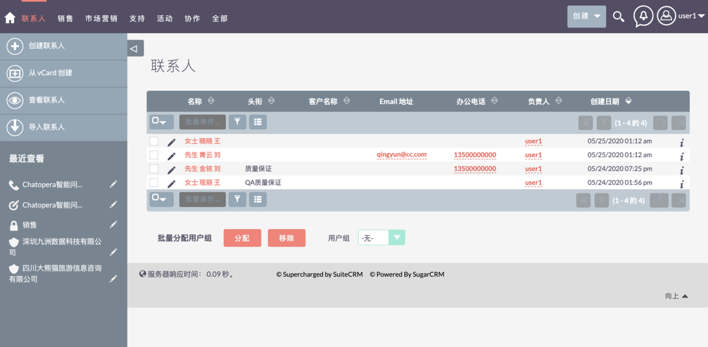

# 联系人管理

## 联系人列表

步骤：顶部菜单->「全部」→「联系人」→ 默认看到所有联系人 或者 左边菜单中「查看联系人」

在「联系人列表」页面可以看到每个联系人的很多属性，比如「联系人名称」、「Email」、「办公电话」、「负责人」名字等等

    

    

## 创建联系人

步骤：「联系人模块」→「创建联系人」

    

可以在此将联系人的很多信息录入，比如「名称」、「部门」、「电话」、「负责人」名字等等。

    

## 联系人详情

在大盛 CRM 联系人详情中，员工可以随时添加与此联系人的所有活动记录。活动记录支持选择写跟进，跟进记录支持选择不同的跟进方式（会议、电话、写信等）。员工可以根据沟通的情况，设置下次联系时间并添加到自己的日程当中。

步骤：「查看联系人」→「点击联系人名称」

    

    

    

## 联系人编辑

步骤：「查看联系人」->「点击编辑」

在联系人编辑页面可以对联系人的信息逐一编辑更新。

    

    

步骤：「联系人详情页面」->「动作」->「编辑」

    

## 联系人导入

在大盛 CRM 系统「联系人」模块的左边菜单点击「导入联系人」，进入导入联系人页面。分为两种导入类型：

- 仅创建新记录
- 创建并且更新现有记录

在此页面执行下面步骤即可完成批量导入联系人

    

### 导入数据的准备

准备要导入的数据文件，或者下载一个数据模板文件参考并创建一个数据文件。导入文件默认是「CSV」格式的文件。建议在导入之前最好是下载大盛 CRM 官方提供的模版，即点击：“下载数据模版” 可以获取，用自己的电脑编辑工具打开，请按照模版的说明操作，填入联系人的数据。

    

### 选择导入文件

    

    

### 确认导入文件属性

    

### 确认字段映射

    

### 检查重复数据

为避免创建重复记录，选择在导入时用来检测重复记录的字段，如果没有问题，点击「现在导入」按钮

    

### 查看导入结果

    

    

## 联系人删除

大盛 CRM 的删除有两种，即「单个删除」、「批量删除」

步骤：「查看联系人」→「选择联系人」→「批量操作」→「删除」
这里「单个删除」与「批量删除」都可以执行。

    

步骤：「联系人详情」→「动作」→「删除」
这里只能执行「单个删除」

    

## 评论

