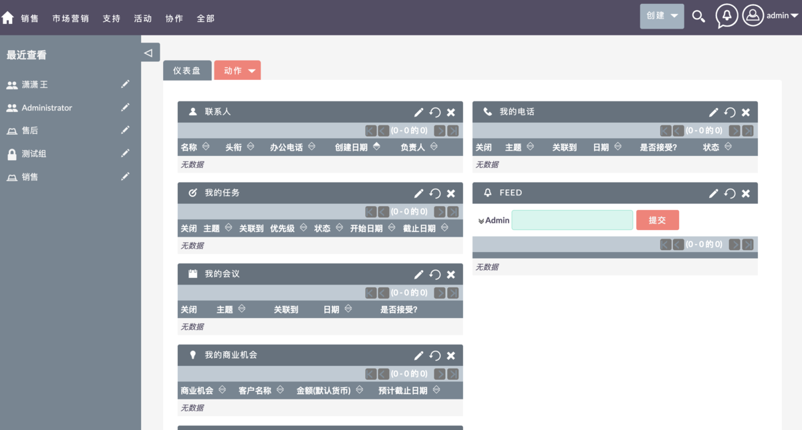
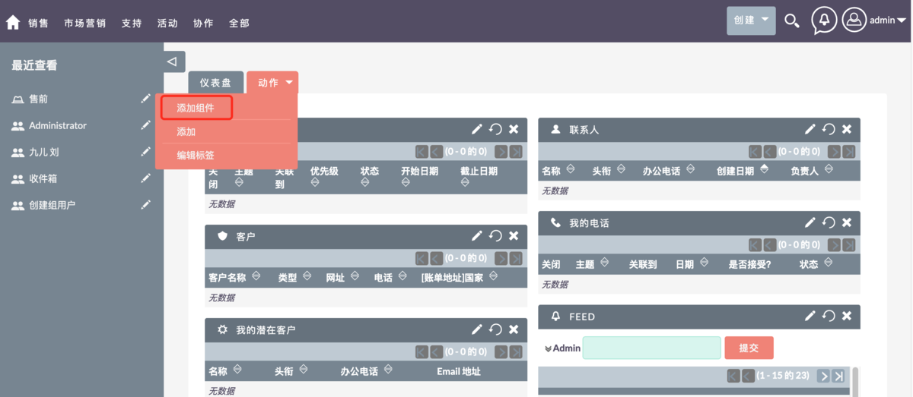
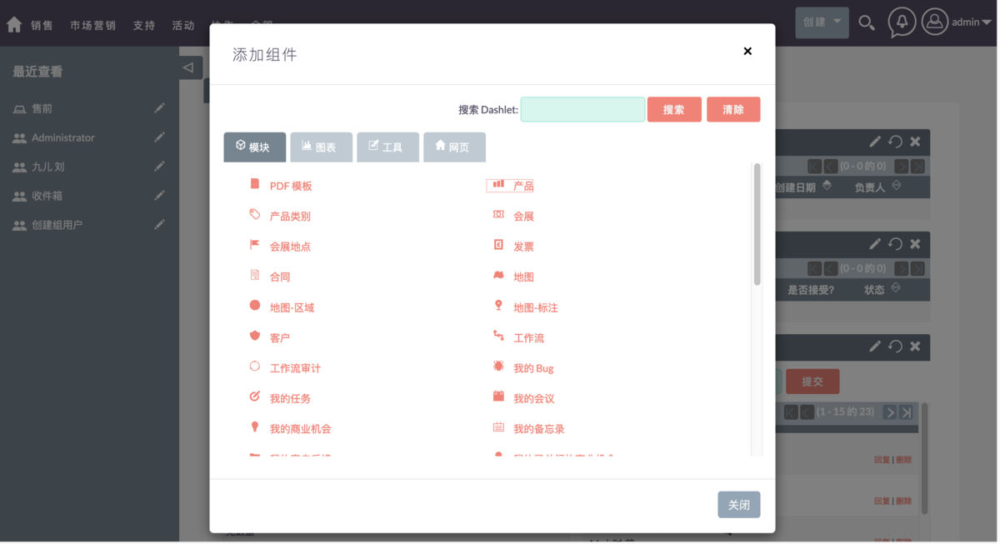
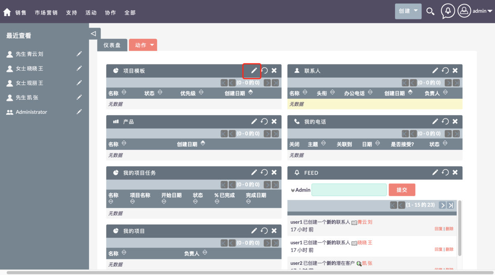
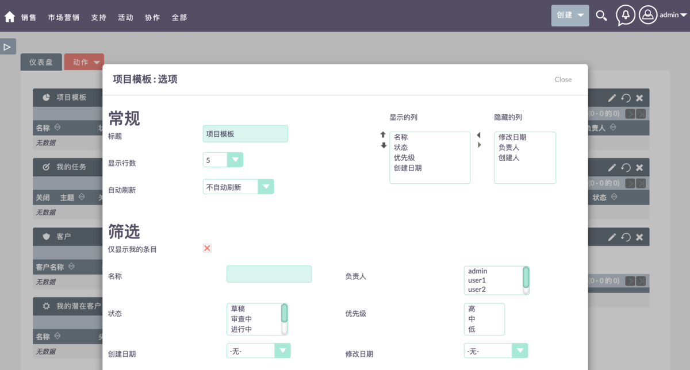

# 首页管理

登录系统进入首页，首页展示了系统部分组件信息，可以自定义首页展示的组件，调整页面组件的布局。

    

    

## 添加组件

步骤：「动作」→「添加组件」→ 「点击要添加的模块」

    

    

## 编辑组件

选择组件点击编辑，可自定义组件展示的列及其它信息。

    

    

## 删除组件

步骤：点击"X"，删除组件。

    

