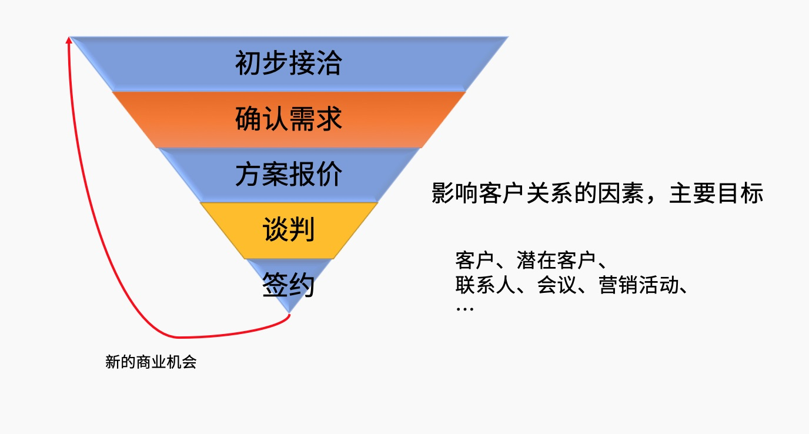

# 大盛 CRM

## 什么是 CRM

CRM（Customer Relationship Management）即「客户关系管理」，是指企业用 CRM 技术来管理与客户之间的关系。在不同场合下，CRM 可能是一个管理学术语，可能是一个软件系统。通常所指的 CRM，指用计算机自动化分析销售、市场营销、客户服务以及应用等流程的软件系统。它的目标是通过提高客户的价值、满意度、赢利性和忠实度来缩减销售周期和销售成本、增加收入、寻找扩展业务所需的新的市场和渠道。CRM 是选择和管理有价值客户及其关系的一种商业策略，CRM 要求以客户为中心的企业文化来支持有效的市场营销、销售与服务流程。

<table class="image">
    <tr>
        <td></td>
    </tr>
</table>

> 为什么需要客户关系管理？

CRM 客户关系管理系统能够协助您精简管理过程以节省人力，使您专注于日常业务。客户管理系统帮助您发现更多商机，达成更多交易，维护更多客户并发展您的业务。客户关系管理系统可以帮助企业销售收入提升 _37%_，客户满意度增加 _45%_，营销投资回报率上涨 _43%_。

- 传递优秀经验，规范企业流程。
- 提升销售，项目管理能力和结单率。
- 减少培训工作。
- 防止出错。
- 积累客户经验于企业自身。
- 产生更多的商业机会。

## 大盛 CRM 的能力

<table class="image">
    <tr>
        <td></td>
    </tr>
</table>

大盛 CRM 是 Chatopera 旗下的一款功能丰富，上手简单的客户关系管理系统软件。可以管理客户关系的整个生命周期。帮助企业建立全新的客户交互体验，简化销售日常工作，实现业务流程自动化，提高销售工作效率并推动创新。借助客户管理系统可以增加与客户的互动，提升客户服务质量，快速而准确地完成从成交到收款的过程，企业获得更多的交易。

在大盛 CRM 中，您可以完成：

- 主动追踪并管理客户资料。
- 团队成员之间可以共同维护客户关系。
- 销售过程的全程管理，随时查看，清晰透明。
- 客户订单合同数据的管理。
- 智能捕获客户的电子邮件，及时了解客户需求。
- 简化重复操作，让您能专注于客户维护，捕捉商机。
- 与企业一起成长，您可随时扩展及定制客户管理系统的功能。

## 大盛 CRM 的服务

- 提供私有化本地部署
- 集成企业内容其它的系统
- 定制化功能开发

## 产品演示

演示环境是为了帮助大家了解大盛 CRM，以下是地址和超级管理员账号。

| 网站                       | 用户名 | 密码      |
| -------------------------- | ------ | --------- |
| https://crm.chatopera.com/ | admin  | admin1234 |

提示：【演示环境】定时刷新且任何人都可以登录，不要更改密码和创建敏感数据，因该网站会**频繁重置数据和升级**，**该网站不能作为生产系统评估**，仅作为应用可行性参考；评估系统，比如压力测试和性能测试，请联系我们，申请试用安装包。

## 商务合作

### 售前洽谈

当前，Chatopera 提供大盛 CRM 的定制开发或私有部署服务，有合作意向的企业联系下面邮箱，进行洽谈：

联系人：张经理

邮箱： <a href="mailto:kai@chatopera.com?Subject=[大盛CRM]商业合作洽谈" target="_top">kai@chatopera.com</a>，电话 (+86)136-9149-0568。

微信：13691490568

洽谈内容包括：

- 概念验证

- 试用申请

- 其他商业合作

_对于企业服务，可提供发票。_

### 售后服务

技术支持和售后服务等，联系邮箱 info@chatopera.com，电话 (+86)158-0121-3126。

## 版权声明

大盛 CRM 为北京华夏春松科技有限公司软件产品，大盛 CRM 使用[SuiteCRM v7.x](https://github.com/salesagility/SuiteCRM)作为基础代码开发。客户购买大盛 CRM 软件后，将自动获得`大盛CRM`源码，该源码以[AGPLv3](https://www.gnu.org/licenses/agpl-3.0.en.html)软件许可授权。

[![chatoper banner][co-banner-image]][co-url]

[co-banner-image]: https://user-images.githubusercontent.com/3538629/42383104-da925942-8168-11e8-8195-868d5fcec170.png
[co-url]: https://www.chatopera.com

## 评论

