# 会议管理

与“电话”模块类似，大盛 CRM 中的“会议”模块允许用户创建他们所参与的任何会议的记录。“会议计划程序”允许用户邀请与会者，向电子邮件邀请者，设置提醒，重新计划并与其他模块相关，包括 客户，联系人，项目和许多其他对象。 此模块具有许多有用的功能，可帮助用户计划和组织会议。

## 会议列表

会议模块：顶部菜单「全部」->「会议」

    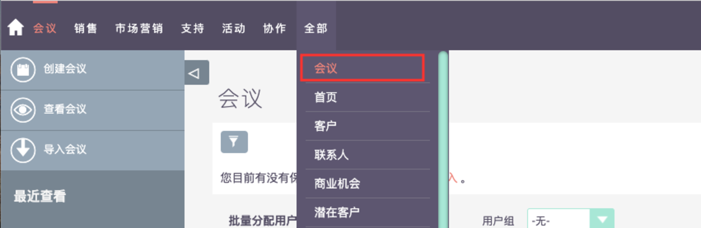

## 创建会议

    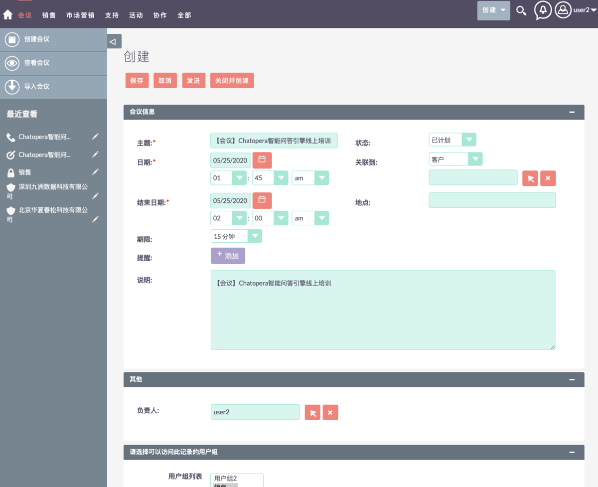

    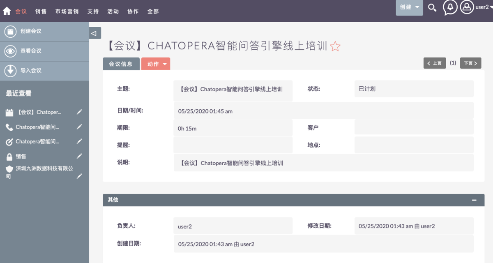

## 查看会议

    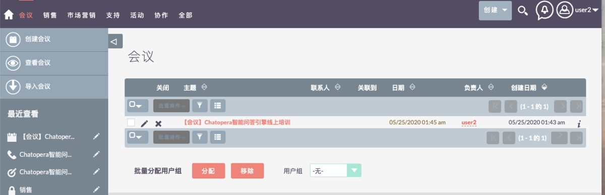

## 导入会议

### 上传数据文件

    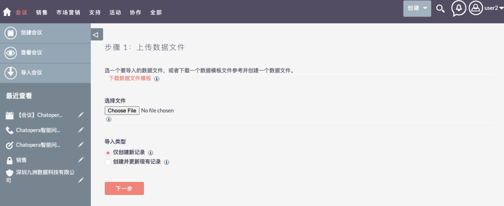

### 确认导入文件属性

    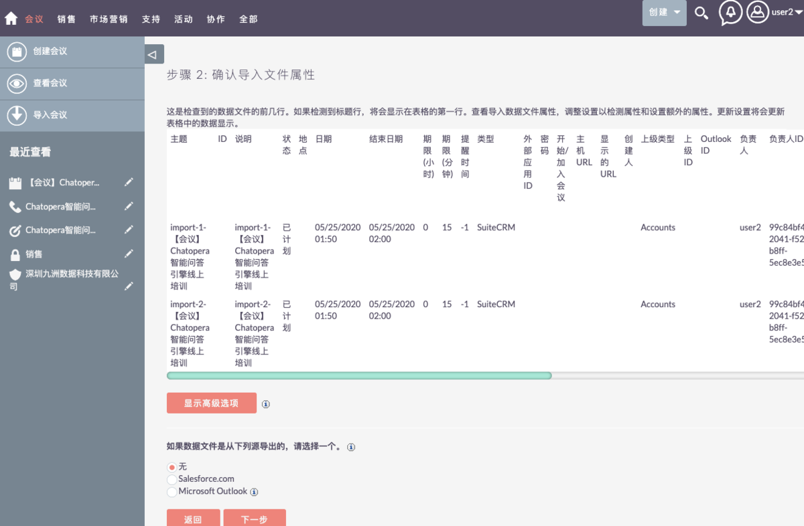

### 确认字段映射

    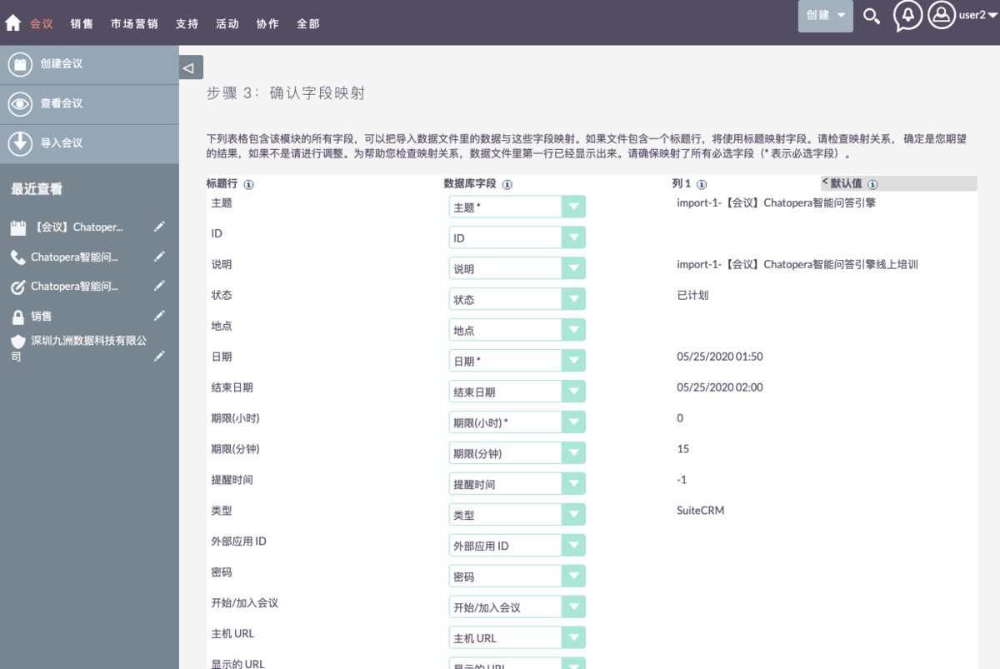

### 检查重复数据

    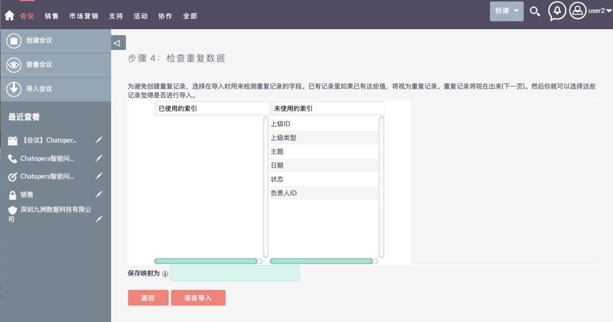

### 上传数据文件

    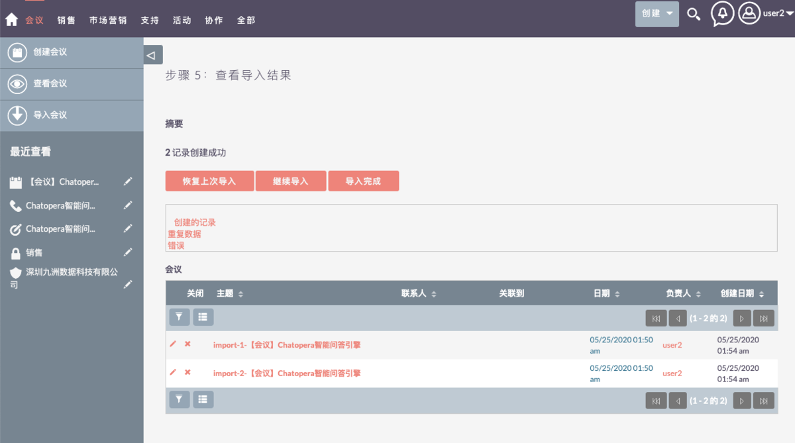

    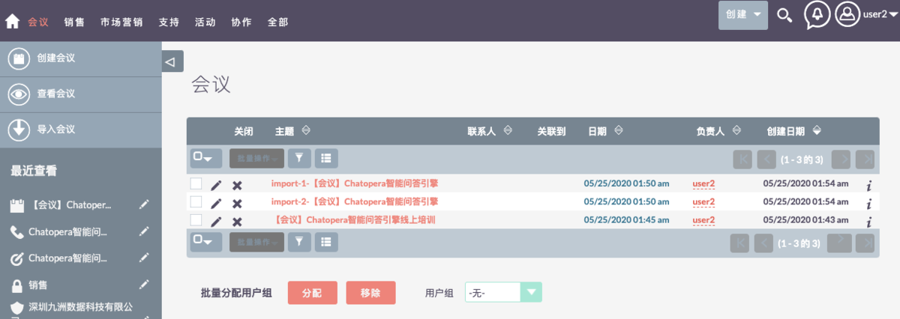

## 会议详情

    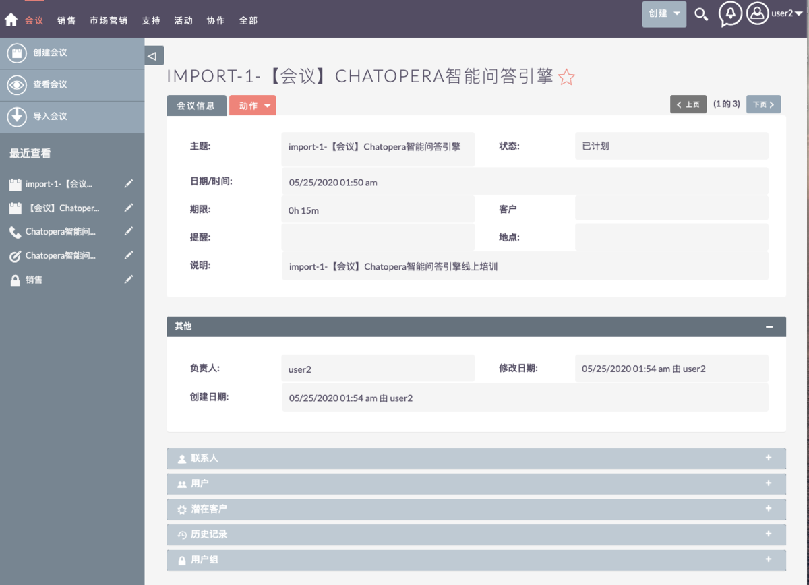

## 复制会议

    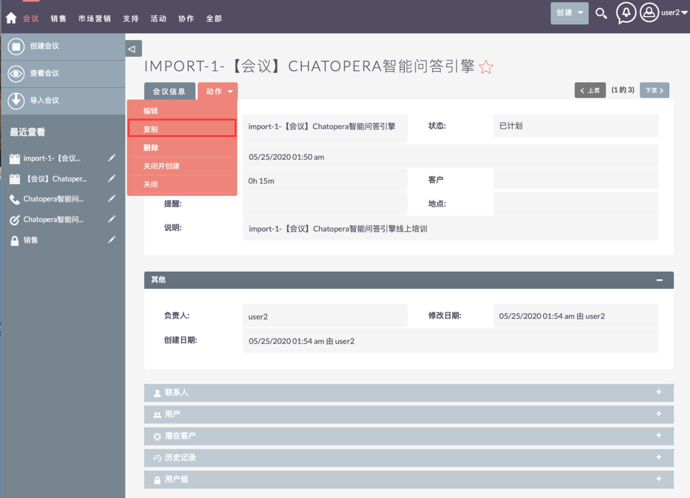

    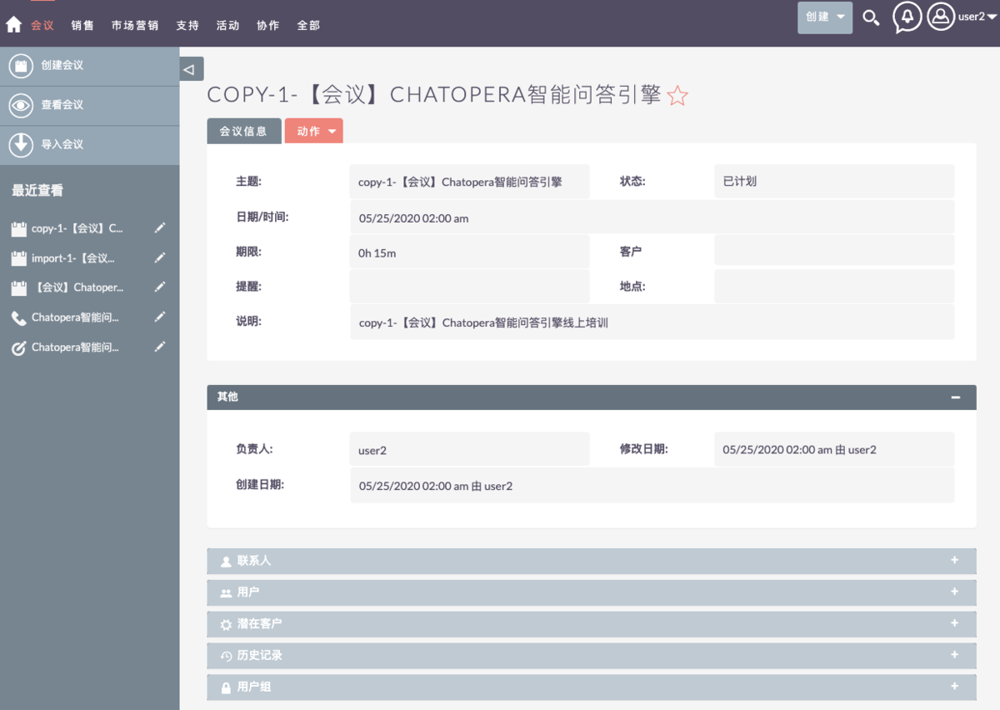

## 编辑会议

    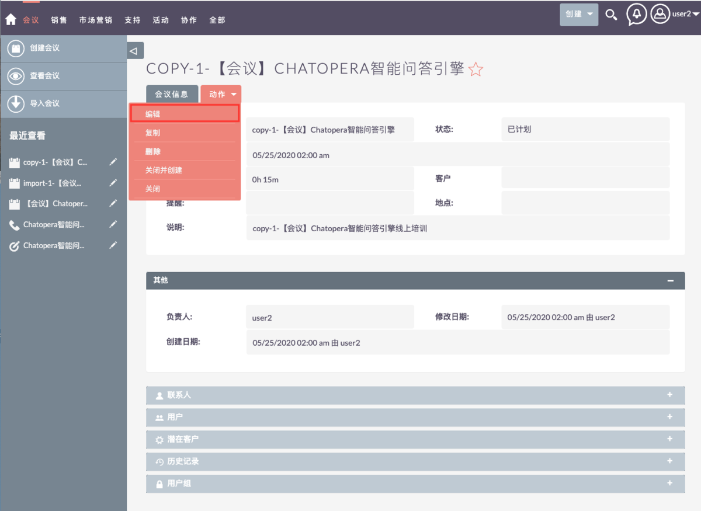

    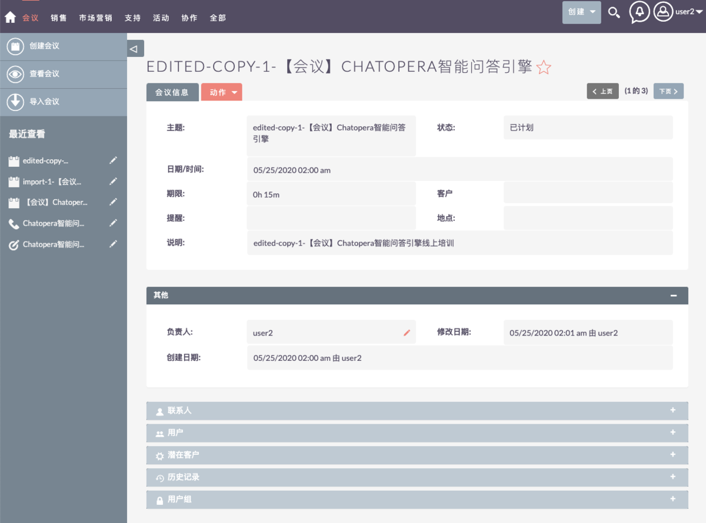

## 关闭会议

    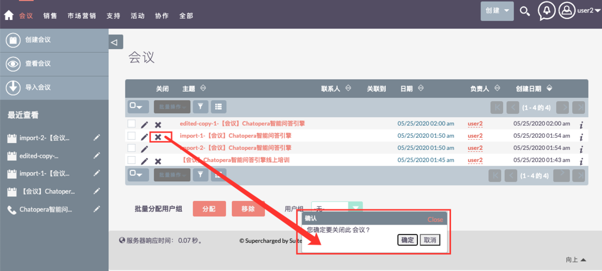

    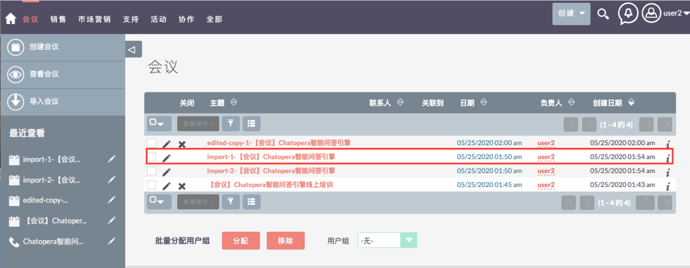

## 删除会议

    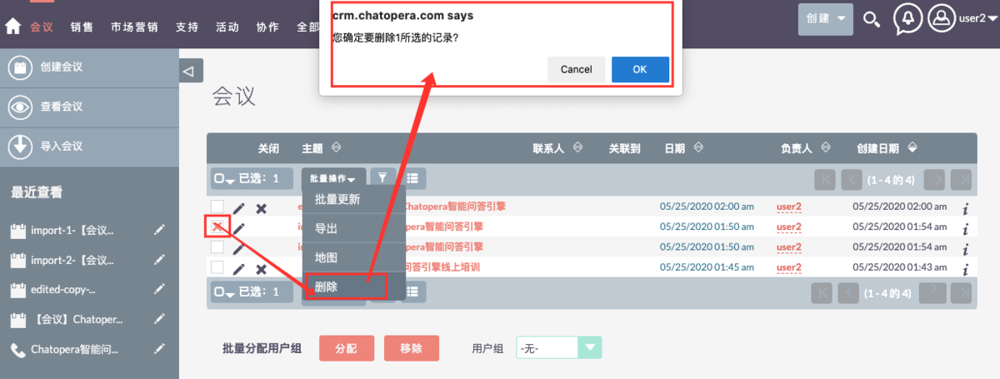

    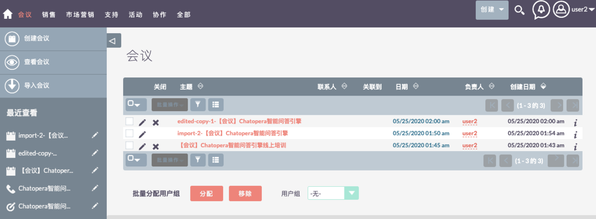

