# 备忘录管理

## 创建备忘录

步骤：顶部菜单->「全部」→「备忘录」→ 左边菜单中「创建备忘录」

    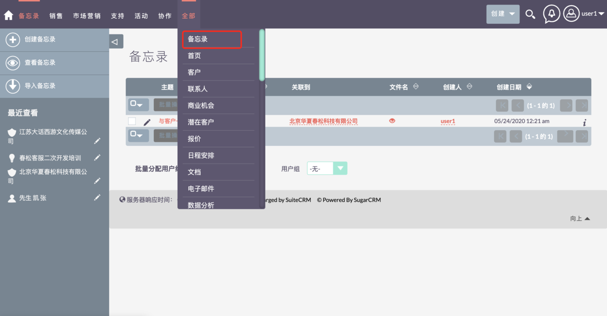

    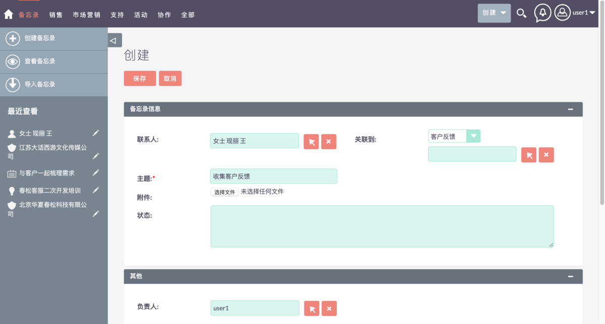

## 查看备忘录

步骤：顶部菜单 →「全部」→「备忘录」→ 左边菜单中「查看备忘录」

    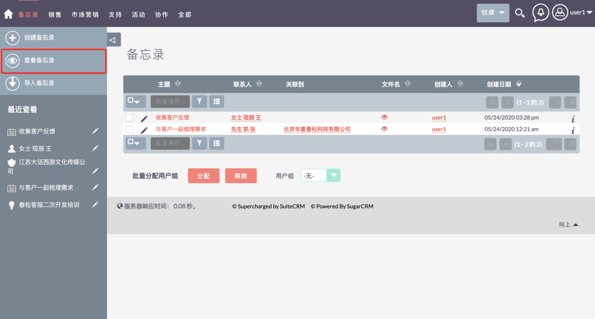

## 导入备忘录

### 导入文件准备或者下载

准备要导入的数据文件，或者下载一个数据模板文件参考并创建一个数据文件。导入文件默认是「CSV」格式的文件。建议在导入之前最好是下载大盛 CRM 官方提供的模版，点击：“下载数据文件模版”，请按照模版的说明操作，填入对应字段的数据。

    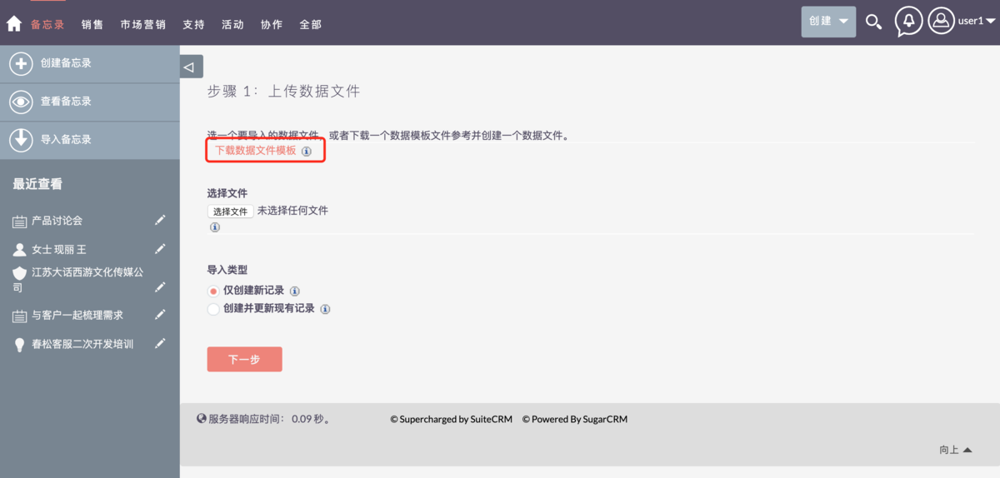

### 选择导入文件

    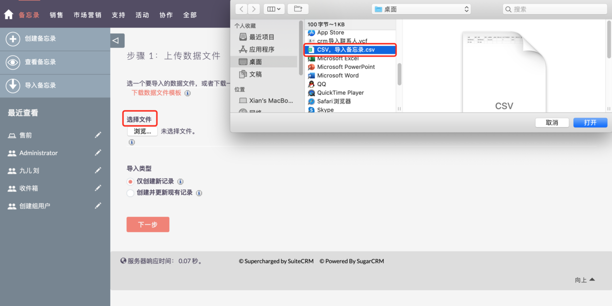

    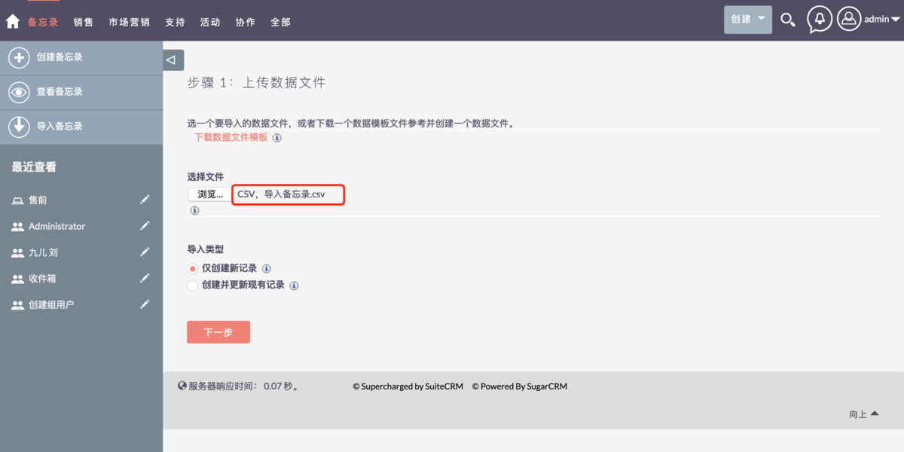

### 确认导入文件属性

    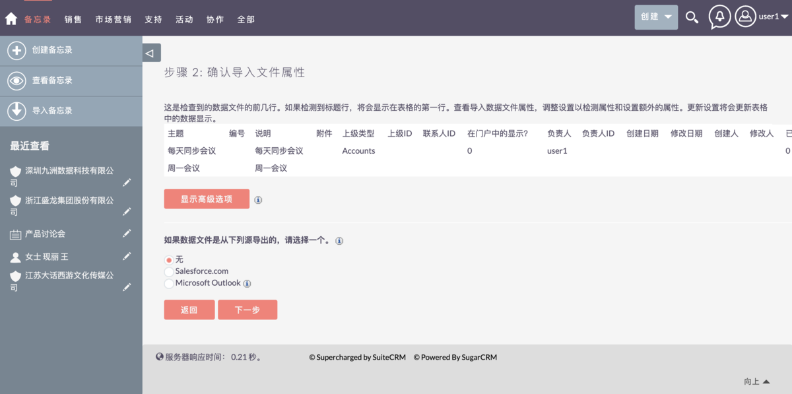

### 确认字段映射

    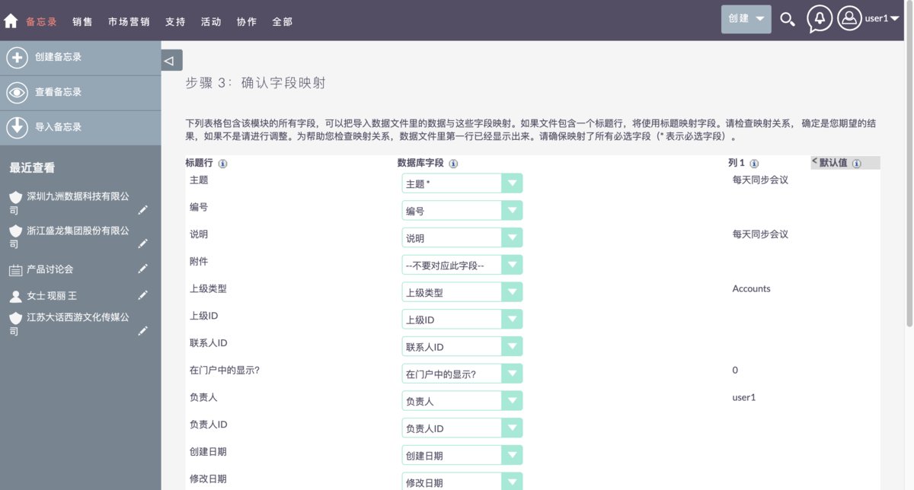

### 检查重复数据

为避免创建重复记录，选择在导入时检测重复记录的字段，如果没有问题，点击「现在导入」按钮

    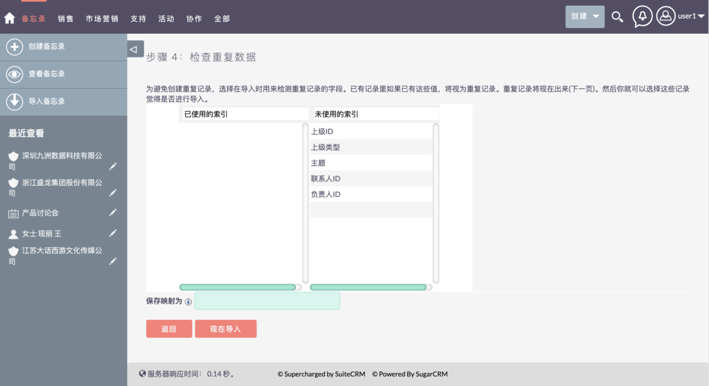

### 查看导入结果

如果数据没有问题，会一次性导入成功

    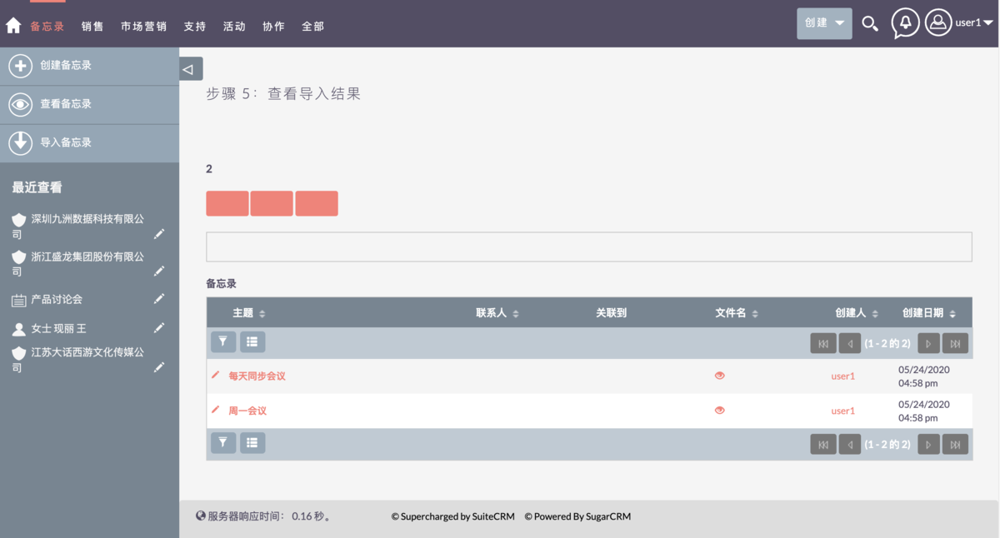

    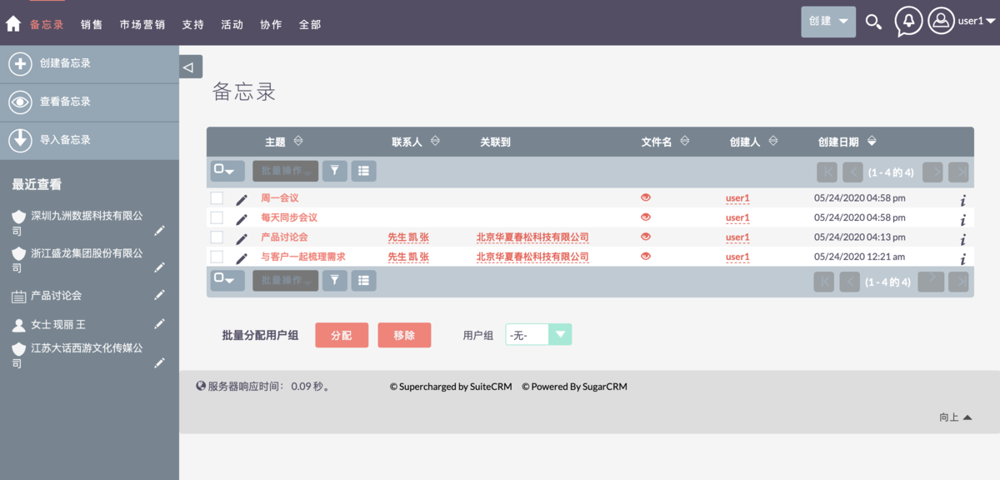

## 删除备忘录

步骤：备忘录 →「查看备忘录」→「选择备忘录」→ 批量操作「删除」

    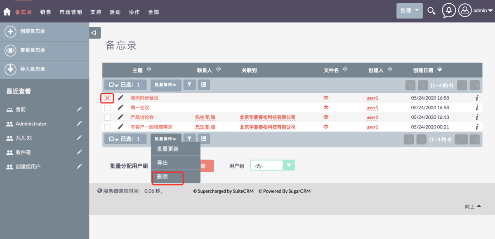

## 评论

