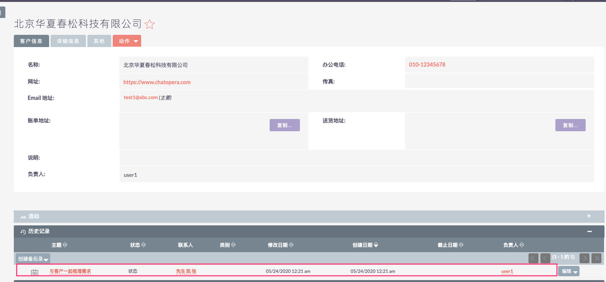

# 快速开始

故事从这里开始，某公司是一家传统的 IT 硬件集成商，从刚开的零个客户到后面慢慢有了客户，这一路上他们对客户的管理一直用 Excel 维护，期间也用过一些 CRM 系统，但是由于没有受到重视，后面就放弃了。目前随着客户数量越来越多，客户对服务的质量也提出了越来越高的要求，客户的数据关系等经常被搞混、丢失。也影响了公司的内外部人员关系，公司的高层也看到这一现象，与销售部门等一起开会商定，需要上一套 CRM 系统，而且这次必须要重视执行下去。

于是公司的 IT 部分和销售部门一起在市场上寻找合适的 CRM 系统和供应商，经过海选，精选以及多次的争吵，最终 IT 部门和销售决定采购 Chatopera 旗下的「大盛 CRM」，并且向老板给出原因：

1）「大盛 CRM」是基于开源的「SuiteCRM」二次开发，功能简单易上手，源码开放，可以看到代码的内部逻辑都做了啥，相对于闭源 CRM 系统减少了企业的顾虑。

2）服务效率也很高，「大盛 CRM」高层对每一个客户都高度的重视，提供 `7 x 24` 小时的专业团队（包括：客户管理维护人员、资深技术人员、测试人员等）支持。

3）「大盛 CRM」还有非常成熟活跃的开发者社区，有很大的企业下载使用，有问题可以从社区也能获取帮助和使用经验。

老板也认为不错，同时也尊重他们的意见，于是从公司的高层开始执行 CRM 系统的使用。

公司新入职了一位销售精英张三，销售效率和能力超强，入职没过 3 天就找到了准客户。按照公司的销售规定是要张三把这个销售机会维护在「大盛 CRM」系统中，方便对销售机会进行整个生命周期的管理。比如包括客户信息的录入、备忘录的创建、销售机会的创建、跟进已经其他相关人员可以看到这个销售机会的演进记录等。

根据「大盛 CRM」系统的用户手册和官方支持，该公司的销售等相关人员很快就把「大盛 CRM」用起来，而且用的还很溜。

为此我们需要从下面几个简单的步骤实现。

## 账号管理

管理员登录。

    

### 用户组和角色

创建一个用户组，“销售”

    

创建一个角色“售前”

    

在销售组中关联角色“售前”

    

### 创建用户

创建一个用户，比如“张三“，登陆用户名“user1”， 密码“admin1234”， 普通用户，添加到”销售“用户组。

    

    

## 销售创建客户

张三，user1 登录

    

    

创建一个客户

    

    

创建一个联系人

    

    

联系人关联到客户

    

    

在客户的「历史记录」上创建备忘录。

    

    

    

## 跟踪商业机会

张三登录

    

创建一个商业机会

    

    

关联到之前的客户

    

    

### 关联文档

张三在这个商业机会上，创建文档

    

    

### 关联会议

张三在这个商业机会上，创建会议。

    

    

    

## 协作信息流

管理员登录

    

在首页 `Feed` 流内能看到张三创建的资源，即客户、联系人和商业机会等。

    

销售总监或者有权限的相关人员都可以在这里方便快捷的看到以及回复每个销售流程中内容。

    

## 评论

