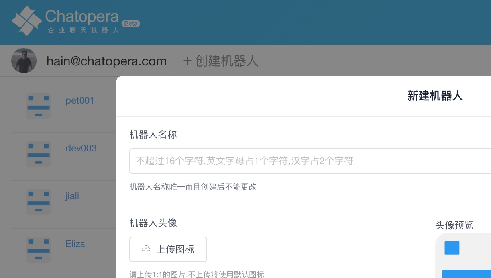
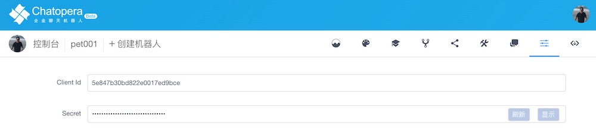

# 心理问答 API

## 产品形态

在 Chatopera 云服务内，用户通过 SDK 调用心理问答 API，按照调用量付费，每个开发者账号每天有 1000 次免费的 API 请求(和其它接口一起汇总)，超过额度后资费参考[计费及发票](/products/chatbot-platform/billing.html)。

心理问答 API 的实现，是爬取全网心理咨询问答多轮对话语料，标注，训练机器学习模型等方法构建。

## 快速开始

为方便快速使用心理对话 API，以下内容以 Chatopera Node.js SDK 为例，介绍从零开始介绍集成服务的过程。

### 前提准备

- 安装 Node.js，参考[文档](https://nodejs.org/en/download/)
- 安装 Git，参考[文档](https://git-scm.com/)
- 文本编辑器及命令行终端，比如[Visual Studio Code](https://code.visualstudio.com/)，[Git Bash for Windows](https://gitforwindows.org/)，[iTerm2 for Mac](https://www.iterm2.com/)

### 注册 Chatopera 云服务账号

参考[账号管理](/products/chatbot-platform/account.html)。

### 创建聊天机器人

<table class="image">
<caption align="bottom">图：创建聊天机器人</caption>
<tr><td></td></tr>
</table>

语言选择`zh_CN`，代表中文简体。点击**确认**。

### 下载示例程序代码

在命令行控制台，执行如下命令：

```
git clone https://github.com/chatopera/efaqa-bot-demo.git
cd efaqa-bot-demo
```

后文所演示的命令，是在`efaqa-bot-demo`路径内完成。

### 配置示例程序

打开刚创建的机器人的`集成`页面，按照如下复制密钥：

<table class="image">
<caption align="bottom">图：复制机器人密钥</caption>
<tr><td></td></tr>
</table>

密钥包括`Client Id`和`Secret`两部分。

使用文本编辑器或 IDE 开发环境，打开目录 `efaqa-bot-demo`。复制`sample.env`文件为`.env`文件。

```
cp app/sample.env app/.env
```

在编辑工具中打开 `.env` 文件并进行编辑，粘贴`Client Id`和`Secret`。

```
CLIENT_ID=5e847b30bdxxx
CLIENT_SECRET=b9ec7axxx
```

### 运行示例程序

在命令行控制台，使用如下命令运行示例程序：

```
cd app
npm i                 # 安装依赖
../admin/start.sh     # 运行demo.js
```

在程序输出的日志中，可以看到调用执行情况，建议阅读 [demo.js](https://github.com/chatopera/efaqa-bot-demo/blob/master/app/demo.js)深入了解，该文件中带有注释说明。

### 核心代码

使用 SDK 调用是非常简洁的，关键代码如下：

```
const Chatbot = require("@chatopera/sdk");
const bot = new Chatbot(CLIENT_ID, CLIENT_SECRET);
let resp = await bot.psychSearch(query, threshold);
let resp = await bot.psychChat(
      channel,
      channelId,
      userId,
      query
    );
```

### 修改问题

示例程序中，读取了一个配置文件[sample.json](https://github.com/chatopera/efaqa-bot-demo/blob/master/assets/sample.json)，可根据需要修改该文件进行测试。

## 更多语言 SDK

除了 Node.js 外，Chatopera 还支持很多语言/框架/运行时，请参考[Chatopera SDK 列表](/products/chatbot-platform/integration.html)。

## API 接口定义

### 查询接口

查询知识库，无上下文关联。

```
chatbot.psychSearch(query [,threshold])
```

- 参数说明

| name      | type   | sample                                             | description                              |
| --------- | ------ | -------------------------------------------------- | ---------------------------------------- |
| query     | string | "确定自己是否有抑郁倾向，想要知道自己当下该怎么办" | 查询条件                                 |
| threshold | float  | 0.2                                                | 匹配度，可适当调整，默认 0.2，非必须参数 |

- 返回值

返回值为 JSONArray 数据结构。

```
[
  {
    "title": "女 我想看看我自己是不不是抑郁了，总是要走，有轻生的念头",
    "description": null,
    "chats": [
      {
        "time": "08:20:10",
        "value": "很好",
        "label": {
          "question": false,
          "knowledge": false,
          "negative": false
        }
      },
      ...
    ],
    "score": 0.3999,
    "label": {
        "s1": "1.9",
        "s2": "2.7",
        "s3": "3.4"
    }
  },
  ...
]
```

对返回值中个字段含义描述如下：

| 字段        | 描述                                                                                                                             |
| ----------- | -------------------------------------------------------------------------------------------------------------------------------- |
| title       | 知识库匹配到文档的标题                                                                                                           |
| description | 知识库匹配到文档的描述                                                                                                           |
| chats       | 针对该标题的回复                                                                                                                 |
| time        | 回复发帖时间                                                                                                                     |
| value       | 回复文本                                                                                                                         |
| label       | 标注                                                                                                                             |
| question    | 回复是否是追问，引导咨询者聊更多                                                                                                 |
| knowledge   | 回复是否带有知识性，给咨询者更多知识                                                                                             |
| negative    | 是否是负面回复，负面回复帮倒忙                                                                                                   |
| score       | 该标题与查询条件之间的相似度，值为`(0,1]`区间，`0`不相似，`1`完全一致，值越大越相似。两个问题越相似，越可以使用 chats 进行回复。 |
| s1          | 烦恼类型， `ID`值对应类别，查看[文档](https://github.com/chatopera/efaqa-corpus-zh#s1-%E7%83%A6%E6%81%BC%E7%B1%BB%E5%9E%8B)      |
| s2          | 心理疾病，`ID`值对应类别，查看[文档](https://github.com/chatopera/efaqa-corpus-zh#s2-%E5%BF%83%E7%90%86%E7%96%BE%E7%97%85)       |
| s3          | SOS 紧急情况，`ID`值对应类别，查看[文档](https://github.com/chatopera/efaqa-corpus-zh#s3-sos)                                    |

返回值中的数组，也是按照 `score` 降序进行排序的。

**注意:** `s1`，`s2`和`s3`是人工标注的，但是我们不承诺做到 100%的准确，这并不代表我们的不尽力，，而是这项工作的困难，仅凭文本对话去推测是不客观的，因此这些标注可认为是`疑似`或`有这方面的倾向`。

如果`score`比较高，比如大于 `0.5`，则查询条件很可能是和检索出来的文档具有相同的`s1`，`s2`和`s3`。

### 聊天接口

实现多轮对话。

```
chatbot.psychChat(channel, channelId, userId, textMessage)
```

- 参数说明

  | name        | type   | sample   | description                                  |
  | ----------- | ------ | -------- | -------------------------------------------- |
  | channel     | string | "test"   | 用户自定义渠道，使用字母和数字，字母开头     |
  | channelId   | string | "nodejs" | 用户自定义渠道标识，使用字母和数字，字母开头 |
  | userId      | string | "uid001" | 访问者唯一标识，使用字母和数字，字母开头     |
  | textMessage | string | "你好"   | 对话文本内容                                 |

- 返回值

返回值为 JSON 数据结构。

```
{
 "createdate": 1588261186.19577,
 "type": "textMessage",
 "textMessage": "这种情况有多长时间了，发生过什么事情吗？",
 "provider": {
  "name": "relevant",
  "extras": "1772826487239379520"
 }
}
```

对返回值中个字段含义描述如下：

| 字段        | 描述                                     |
| ----------- | ---------------------------------------- |
| type        | `textMessage`, 文本消息                  |
| createdate  | 消息创建的时间戳，unix timestamp         |
| provider    | 回复的域，`name`代表消息从什么技能取得的 |
| textMessage | 回复文本内容                             |

- 技能域

`provider.name`值的含义：

| 值       | 技能                                                     |
| -------- | -------------------------------------------------------- |
| relevant | 知识库                                                   |
| intent   | 意图识别多轮对话                                         |
| chichat  | 寒暄语料                                                 |
| fallback | 兜底回复                                                 |
| cipher   | 预定义问答对，适用于特殊的需求，比如 `@SESSION_DESTROY@` |

关于 `@SESSION_DESTROY@`的使用参考[示例程序](https://github.com/chatopera/efaqa-bot-demo/blob/master/app/demo.js)。

- 建议回复

兜底回复实际上没有什么意义，因为相当于没有回复。这种情况的发生，可能是语料和算法的不足。那么，从机器人处还会携带可能的有效的回复，但是它们的置信度较低，所以，使用`suggs`数组返回。

```
{
 "createdate": 1588261726.790463,
 "type": "textMessage",
 "textMessage": "你好，我没明白你的意思。",
 "provider": {
  "name": "fallback",
  "extras": null
 },
 "suggs": [
  {
   "text": "减压 陪伴 鼓励",
   "label": {
    "question": false,
    "knowledge": true
   }
  },
  ...
]
```

`suggs`是建议回复数组，类型为 JSONArray，每个元素的字段含义描述如下：

| 字段      | 含义           |
| --------- | -------------- |
| text      | 回复文本内容   |
| question  | 是不是追问     |
| knowledge | 是不是有知识性 |

- 会话周期

此接口是考虑用户回答的历史的，但是有时间限制，每个会话周期是 _20 分钟_，可发送 `@SESSION_DESTROY@`清除当前会话周期，那么下次再次聊天建议新的会话周期。

会话周期的影响：当机器人识别到了一个话题，在同一个会话周期内，会围绕这个话题展开。

如何判断机器人识别到了一个话题：`provider.name`是`relevant`或`intent`时，代表识别到话题。

### 异常返回

如果服务访问出现异常，或参数不合法，则会抛出异常，所以，建议调用接口时增加 `try/catch`，在不同 SDK 中，也会提示异常类型等信息。

## 评论

<script src="https://utteranc.es/client.js"
        repo="chatopera/docs"
        issue-term="pathname"
        label="Comment"
        theme="github-light"
        crossorigin="anonymous"
        async>
</script>
