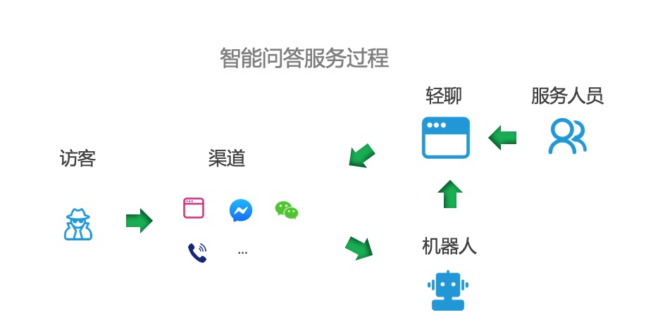
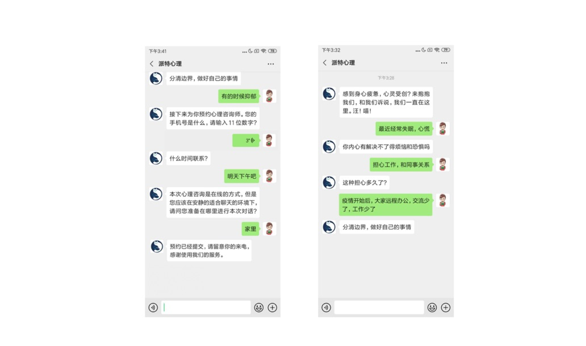
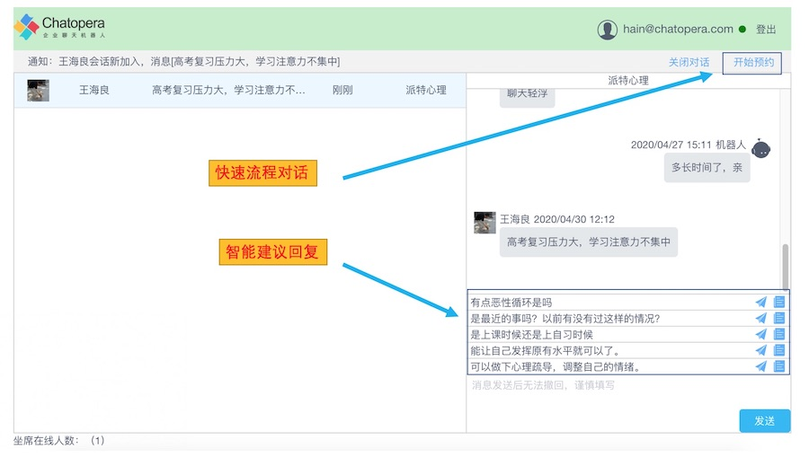

# 心理问答服务

## 产品形态

一套对话服务方案：访客通过不同渠道连接到智能问答，先根据访客问题查询机器人，机器人命中答案后直接回复，否则问题传递给“轻聊”系统，轻聊后台由服务人员处理咨询问题。

<table class="image">
<caption align="bottom">图：心理问答服务过程</caption>
<tr><td></td></tr>
</table>

- 支持多轮对话，数十万预置心理咨询问答语料
- 支持预约心理咨询师流程对话，可定制更多流程对话
- 服务人员可使用 Chatopera 提供人员，或客户自己的人员

## 机器人对话示例

| 问题                                                                                                | 机器人回答                                                                                         | 聊天室                                                      |
| --------------------------------------------------------------------------------------------------- | -------------------------------------------------------------------------------------------------- | ----------------------------------------------------------- |
| 女 最近感觉有轻生的念头，是有抑郁症吗？                                                             | 有抑郁的倾向，可以通过心理咨询改善了。                                                             | [给力心理](https://www.geilixinli.com/question/376507.html) |
| 女 就是精神上出轨，然后慢慢的就是肉体出轨，一旦出轨回不了头了，怎么办？，然后两个夫妻越来越没有感情 | 你之所以不敢再相信他，是因为你觉得受伤了，你心里的受伤感的感觉没有得到处理，这个不舒服一直在那里。 | [给力心理](https://www.geilixinli.com/question/376441.html) |
| 女 孩子总是咬指甲怎么办需不需要看心里医生                                                           | 如果无损健康，可不必过多关注                                                                       | [给力心理](https://www.geilixinli.com/question/376415.html) |
| 女 总是感觉不到快乐，不开心。内心很脆弱                                                             | 容易感伤，都想哪些事情？                                                                           | [给力心理](https://www.geilixinli.com/question/376422.html) |
| 女 经常偏头疼，心里压抑，怎么解决抑郁情绪                                                           | 多大了                                                                                             | [给力心理](https://www.geilixinli.com/question/376479.html) |

注意：

- 以上仅展示单轮回答，实际上每个问题都可以进行多轮对话
- 以上内容为测试数据，在机器人语料中并不存在

## 预约咨询师

在心理咨询对话期间，机器人可自动识别来访者疑似病情，并询问来访者预约平台专业心理咨询师。

<table class="image">
<caption align="bottom">图：预约心理咨询师</caption>
<tr><td></td></tr>
</table>

- 心理咨询预约情况可通知到工单系统或邮件等渠道。

同时，一些其它在咨询中常见的对话流程，收集信息等都可以训练机器人实现。

## 轻聊系统

机器人的智能化水平依赖于大量数据，同时技术发展没有到可以胜任回答各种心理咨询的程度，为咨询者提供优质的心理咨询服务，还需要在机器人回答不好时，借助真人在线回答，但服务人员也是在机器人的辅助下，有很高的效率。

<table class="image">
<caption align="bottom">图：轻聊系统</caption>
<tr><td></td></tr>
</table>

- 轻聊系统可以不断积累数据，提升机器人智能水平

## 客户案例

派特心理提供心理咨询服务、心理学知识，尤其是面向企业白领，为来访者提供情感关系、职场压力、躁郁等方面的专业心理健康服务。

<table class="image">
<caption align="bottom">图：派特心理</caption>
<tr><td></td></tr>
</table>

Chatopera 心智能为派特心理提供心理咨询 AI 助手，满足轻度健康支持和智能预约服务，发送心理咨询问题进行体验。

心理问答服务并不是面向开放域的聊天服务，请发送心理疾病、心理咨询相关的问题，参考前文[《机器人对话示例》](/products/psych-assistant/service.html#机器人对话示例)。

## 评论

